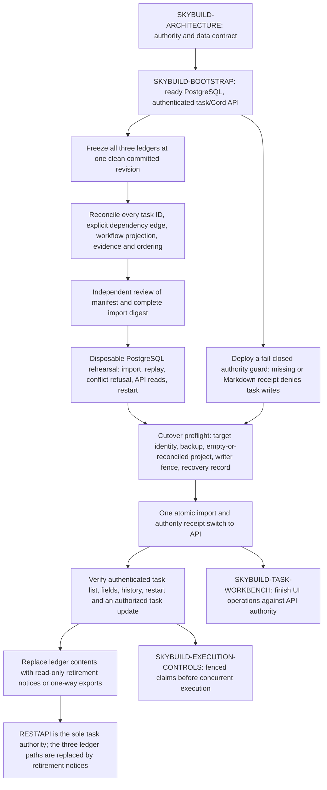

# SkyBuild implementation plan

Derived from architecture revision A42, 2026-10-09. Status: MVP sequence refined; the launch-free task API and frozen-ledger cutover are complete for the SkyBuild project. Fleet activation and model execution remain separate boundaries. [architecture.md](architecture.md) governs. This plan supersedes the delivery section of the dated combined revision 2 plan.

## Planning discipline

When architecture changes, update the affected work areas, dependencies, interfaces, acceptance and task records here in the same revision. Keep detail proportional to the next decision. Each major item should have a compact brief with exact scope, fixed interfaces, completion evidence and a bounded correction allowance when selected for implementation. Task IDs below originated in the frozen [ledger snapshot](mastertodo.md); this plan is not a second queue, and the API is now authoritative.

The selected [bootstrap brief](implementation/bootstrap.md) fixes the first API/Store contract and manually assigned work scopes. Introduce migration or execution area plans when those boundaries are ready for sustained work and need independent review. Keep this parent plan as the sequence and boundary map, and link each area's governing architecture sections.

## Petri workflow project (priority 5)

Parent task: `SKYBUILD-PETRI`. [Compact design and simplicity review](petri_workflow.md), derived from architecture section 5. The owner requested design first. Exactly seven places replace the earlier many-phase proposal; validation substages travel as token evidence and confirmed V/I failures return to Ready. Preserve existing API task authority, journal, dependency, claim and effect contracts.

Proposed sequence: four small domain classes and one guarded transition table; transactional Store and compatible API; existing worker/check/review/rebase/bundle wiring; seven-column workbench; transition and recovery acceptance. Twelve approximately 30-minute implementation slices are API tasks, all priority 5. Review, corrections and gates add time. No SNAKES runtime dependency is needed initially; retain it as the best-fit optional colored-net modeling library. Do not add a scheduler, database or event bus. Delivering this design does not implement or deploy it. Other accepted components keep their existing task identity and ownership; Petri adapts their seams rather than reimplementing their scope.

## MVP delivery target

Task: SKYBUILD-SELF-BUILD-MVP. Architecture: sections 3 and 16. The owner's MVP is a running product that rebuilds itself and adds features with parallel workers. The launch-free API is an intermediate deliverable, not the endpoint of MVP.

Compose the useful task/Cord bootstrap and cutover, minimum task status/rework interface, applicable CPU/model controls, one qualified author/reviewer route, bounded Keeper workers and bundled integration. Demonstrate two independent task attempts in isolated worktrees while the accepted controller remains usable, then review, combine, test and publish their accepted feature changes. Exercise one rework or interrupted attempt with a known next action and recovery without duplicate work. Test a compatible controlled update and recovery boundary; candidate success is not self-promotion authority. Apply normal shared budgets and model slots; active workers need not issue model calls simultaneously.

Deliver only the slices required for that demonstration. Disjoint SkyBuild authority avoids unrelated legacy migration dependencies. All-provider/account completion, complete extraction, cloud bursting and the dedicated complexity/size gate suite with its GUI are not MVP prerequisites. SKYBUILD-QUALITY-GATES is deferred until this milestone is running; retain its design so SkyBuild can subsequently build that feature itself. This is planning, not permission to launch workers now.

After the running MVP, prioritize SKYBUILD-QUALITY-GATES and SKYBUILD-QUALITY-DEBT-CLEANUP among the first follow-on tasks. Add pinned Ruff rules, including McCabe `C901`, to the code-review checks. Measure the whole repository, turn every actual debt finding into a tracked cleanup item, and land behavior-preserving fixes with tests and independent review. A baseline makes inherited findings visible during rollout; it is not a permanent debt waiver. Then enable SKYBUILD-REPO-REVIEW-CADENCE: schedule a whole-repository background code review after the first of 1,000 accepted commits or 5,000 changed source-code lines since the last completed review. Hold later reviews until every actionable finding from the prior review has a published accepted fix. Deduplicate accidentally concurrent starts and findings by a durable review identity and source baseline; expose both thresholds in the GUI in a later settings slice. These steps do not retroactively gate MVP acceptance.

### Shortest implementation path under A35

This sequencing refinement implements the existing MVP boundary; it does not mark entire parent tasks complete when only an MVP slice is delivered. Keep the remaining scope in the same task history. The first useful implementation brief should cover the launch-free bootstrap contract, not the entire execution-control catalogue.

| Order | Essential deliverable | Exit evidence and dependent work |
| --- | --- | --- |
| 1 | One laptop service and dedicated PostgreSQL; authenticated tasks, append-only history, minimal Cord and shared client. | Disposable-database, auth, revision/idempotency and restart checks; private Tailscale access. No launcher. Reuse contracts and tests, not the legacy SQLite transaction implementation. |
| 2 | Frozen ledger import and one authority switch; thin task workbench. | Lossless import and read-only file exports. Task scope/definition, dependencies, rework, split/merge and deferral remain manageable; every unfinished task has a next action or named blocker. Basic management works without inference. |
| 3 | CPU ownership, restrictive controls, atomic resource reservations, effect identities, local launch journal and independent observation. | Fencing, replay, lost-start acknowledgment, stop/reboot and offline reconciliation tests. Add generation-based invalidation before automatic use. A report-only then CPU canary precedes model execution. |
| 4 | One qualified author/reviewer route and the Keeper slice that uses it. | Separate author and reviewer sessions, applicable budgets/billing controls, context limits, bounded correction, drain, five-minute default closeout and model cutoff. Complete disconnect/stop/update checks before two task attempts are enabled. |
| 5 | One deterministic integrator and trusted GitHub publisher. | Freeze reviewed heads/base/policy, run the union of required combined checks, reconcile actual publication and record each task's inclusion. Unknown publication retains ownership. Candidate code cannot access publishing/check credentials. |
| 6 | Self-build acceptance and a controlled compatible update. | Two independent feature tasks overlap in owned worktrees while the accepted controller serves task/status requests. Review both, gate and publish a combined candidate, recover one interrupted/rework case without duplicate work, then exercise the controlled update and manual recovery path. |

Steps 4 and 5 can be developed against fixed contracts and fake adapters while step 3 is being validated. Their live adoption still waits for the applicable controls. Do not wait until the end to discover that no reviewer profile or remote publication mechanism can qualify: investigate those two feasibility risks early, without starting runtime work.

One profile may qualify for both authoring and review, but those are distinct qualifications and sessions. The shared endpoint's model-list response proves neither. A narrow Qwen author path does not remove the need for a qualified coordinator/reviewer for higher-risk work. Start with whichever allowed route first meets the actual task classes and enforceable controls; additional accounts/providers and automatic failover can follow as their adapters qualify. An unavailable alternative stays disabled. Do not build a universal agent harness to use the shared endpoint.

### Parallel work without enlarging the MVP

Before fenced claims exist, bootstrap coding uses manually assigned, non-overlapping scopes. The owner subsequently authorized Sol/Luna subprocesses to begin implementation while away on 2026-10-08; this permits manually coordinated bootstrap agents, not activation of the old fleet or an unimplemented automatic claimer. The MVP itself demonstrates managed parallel workers only after the controls are accepted. Two active tasks require two owned worktrees and adequate CPU/memory; they do not require two hosts, two providers or simultaneous model requests. Worker placement remains a canary-time choice: do not infer permission to allocate jeltz or heavy work on the controller laptop. Aragog remains a proposed canary with its separate start/runtime controls.

The manual transport pilot uses `wonko` and `wowbagger` with the main session as dispatcher/integrator. The deployed API has a restricted PostgreSQL runtime role, private application TLS and separate project-scoped worker credentials. Both boxes previously passed scoped REST/Cord qualification; after the promoted image change, Wonko passed a fresh owner-authorized receipt/reply preflight. These checks establish private transport and mailbox behavior, not accepted coding work. The relay now reads the current task through the authenticated API, permits only `ready` or `in-progress`, and pins task status/revision in a `manual-work-v2` envelope. The worker rechecks that exact snapshot before receipt. The dispatcher credential must include project-scoped `tasks:read`; update the existing deployed principal before dispatch resumes. Then use disjoint bounded briefs, owned branches/worktrees, cheap checks, exact-head reporting, independent review and bundled integration. Do not add another queue, schema, daemon or launcher. Lost/duplicate messages, changed ownership and offline reports retain one assignment identity and an actionable next step. The pilot remains launch-free and has not yet supplied coding evidence or fenced-worker MVP acceptance. See [manual worker pilot](implementation/manual_worker_pilot.md).

Once ownership is ready, use three bounded implementation areas rather than permanent model roles:

- Task/control area owns database transitions, admission and the thin task/control pages.
- Worker area adapts Keeper, the shared client, local journal, observer and one engine/profile against the accepted API contract.
- Delivery area owns review records, frozen bundles, gate collection and publication against the accepted task/effect contracts.

Assign non-overlapping files or serialize shared-interface changes. Keep one schema/contract owner for each change. Separate review uses available qualified capacity; it need not consume a permanently reserved worker. One fenced integrator serializes publication while authors work on the next tasks. Bound admission by review/gate backlog so extra drafting cannot delay accepted changes. These are future work boundaries, not launched agents or a second task ledger.

### Essential now, parallel operations, and later scope

Essential MVP controls include basic task editing and stuck-task visibility, an append-only journal, independent observation, applicable authorization/budget/query-cutoff enforcement, separate-session code review, bundled integration, and the stable-controller/manual-recovery boundary. A small UI is sufficient; these behaviors cannot be dropped as dashboard polish.

Roll out the bounded CPU-only host watcher as development tooling on each active SkyBuild box, including Wonko, before relying on host resource readings for heavy local gates. Commit its script and skill together, update each checkout to that version, and have each local Codex session load the checkout-local skill. One minute-spaced process per host-local status file samples memory reserve, workspace and temporary disk headroom, task-owned disposable Docker containers, and stale or prunable worktree metadata for its checkout. It writes one atomic status file without model polling. Treat stale or unknown readings as insufficient evidence for a new heavy gate. Start with the owner's 8 GiB reserve on this machine and set each other host's reserve explicitly. The owner-directed disposable PostgreSQL gate has a current-session 6 GiB admission exception; it does not change the watcher reserve or worker capacity limits. The watcher reports only; it neither launches workers nor cleans resources. Add owned worker processes and further resources when lifecycle identity and ownership make those observations reliable. This early aid feeds gate decisions but does not satisfy the managed observer or admission milestones. For launcher-owned cgroup units, have the same minute loop write a separate durable capacity file from bounded per-attempt manifests and cgroup or systemd peak counters. Verify the hard per-job memory cap used by the launcher, reserve all active units' remaining cap, retain peak/source/time across restarts, and raise an advisory worker target by at most one after five healthy samples with fresh completed-job evidence and observation of the prior concurrency level. Unknown launch state or counters admit no new job. Require launcher-side authority and hard cgroup enforcement before using this number to start work; this read-only guidance does not itself ramp the fleet. Persist the last counted sample timestamp and require at least 60 seconds between counted healthy observations across calls and restarts. Preserve the existing 24-hour evidence freshness limit and refuse future counted times. Reject actual, declared, retained-measurement or prior-configuration hard caps that disagree with the configured new-job budget, exposing unknown status and zero new-job guidance.

Daily database dump-file commits remain a normal-priority planned operation after the database exists. Develop this alongside the delivery path and settle its destination/encryption/retention before enabling publication. It is not a reason to wait for the separate low-priority restore/journal-rebuild drill. This refinement does not silently defer the daily task or claim database recovery from source commits.

Complete legacy migration and tooling extraction remain required later adoption work, but are outside the disjoint SkyBuild MVP critical path. Additional provider/account variants, Recall/BGE, rich dashboards, dedicated complexity/size gates and their GUI, multi-person approvals, cloud economics/bursts/transfer and HA are not required to demonstrate MVP. Preserve their existing task IDs, priorities and revisit triggers; “outside the MVP path” does not mean cancelled or moved to the deferred ledger.

### Blocking decisions at their actual boundaries

| Boundary | Must be resolved before crossing it | Can proceed beforehand |
| --- | --- | --- |
| Bootstrap implementation | API/revision/idempotency contract, PostgreSQL driver/migrations, owner/worker scope matrix and credential/browser-session mechanics. | Focused source inspection and a compact contract proposal. These are ordinary design choices unless they change owner policy. |
| First worker canary | Selected allowed host/resources, local launch/stop acknowledgment protocol and bounded offline deadlines. | Fake-process validation, journal/observer design and the launch-free service. No VM start is implied. |
| First model canary | Qualified author and reviewer task classes; selected profile's enforceable billing/usage/resource limits, numeric bounds and context/closeout policy. | CPU work and disabled adapters. Unknown frontier controls block that frontier path; shared inference has its own applicable controls. |
| Automatic publication | Actual repository flow that enforces tested head/base and trusted checks; bounded bundle membership/coalescing and correction/diagnosis limits. | Local frozen-candidate tests using a fake publisher. A lease or expected PR head alone is insufficient. |
| Daily backup publication | Destination, format, schedule, encryption/key custody and retention. | Dedicated database bootstrap and isolated dump validation. |
| Runtime update | Pinned artifact, compatible schema/protocol, drain/reconciliation and independent manual recovery. | Candidate build/test/publication. Passing gates cannot grant promotion authority. |

No owner answer currently blocks this sequencing refinement. Ask one question only when a selected boundary needs owner intent or authority that available evidence cannot supply. Do not reopen settled MVP, review, hosting, billing or quality-gate decisions.

Read-only reuse evidence on 2026-10-08: CodeGraph verified the SkyKeep project path before inspection at commit `383d3d375979c66b39df0f61c19a165957fecdcf`. `scripts/agents/session_keeper.py` SHA-256 `96d481abebfb6053f41c66bd41c5c630af46ac998a3bd2c7cb3ad1ad59b8438f` exposes the reusable process adapter and usage handling; its model-driven stale-usage probe must not be inherited as the new cache-only collector policy. `scripts/todo_service/store.py` SHA-256 `2a4954d12c6de932e53ad95fb087219d95292e6454124563cc4ed5fe67c3a913` still uses SQLite `BEGIN IMMEDIATE`; it is contract/test evidence, not a ready PostgreSQL Store. These are checkout observations, not installed-service qualification. [MVP parallel model evidence](models/MVPParallel.md) checks the bounded admission slice and its limits.

## 1. Settle the initial architecture boundary

Task: SKYBUILD-ARCHITECTURE. Architecture: sections 1–7 and 12.

Review the extraction boundary, authority transition and launch-free bootstrap with the owner. Confirm which unresolved choices must be resolved for the first service: concrete network setup, concrete authentication mechanics, task representation and import mapping. Owner/admin credentials and separate project-scoped worker tokens are confirmed; settle the exact operation matrix, owner enrollment/recovery and browser-session handling. The contact-loss UI choice/default is confirmed: finish the current task, with checkpoint/stop selectable. Initial API/PostgreSQL placement on the owner's laptop and Tailscale access from all intended enrolled boxes are confirmed; do not introduce a server-provisioning or VPN-provider-selection prerequisite. Daily database dump-file commits are now planned after the dedicated database exists. Full restore and journal-based rebuild validation is a low-priority task; journal location and commit interval remain open. Assume project delivery pushes owned commits to GitHub; GitLab/Bitbucket support is deferred. Apply the confirmed task-owned reset/clean and post-merge branch/worktree cleanup policy, protecting other workers’ work and shared branches without a blanket command ban. Keep later spend/drain policy questions explicit without forcing a complete fleet design into the initial API item.

Use the compact module/topology proposal in architecture section 13 when reviewing reuse. Preserve explicit safety boundaries while reducing repetitive code and context. Plan SkyBuild's self-build path against a stable accepted controller and disposable candidate environment; building the replacement cannot promote it or change its own authority.

The result is a coherent architecture revision and ADR status, an updated implementation sequence, and a selected next task. It is not an implicit instruction to deploy. The owner can authorize an item separately after reviewing its concrete scope.

## 2. Establish the PostgreSQL task and minimal Cord service

Task: SKYBUILD-BOOTSTRAP. Depends on the agreed bootstrap boundary of SKYBUILD-ARCHITECTURE. Architecture: sections 3, 5–7.

**Verified complete for the deployed manual pilot (2026-10-09):** the pinned service is healthy on schema 12 with the restricted runtime-role audit passed. The full disposable PostgreSQL gate passed 1,052 tests (1 skipped). An authenticated owner client retrieved the imported task list; a scoped remote worker completed the bounded Cord receipt/reply round trip over certificate-verified private TLS. API and database remained intact across the service replacement/restart. This qualifies the launch-free bootstrap and private manual-client path only; it grants no worker launch or model authority.

Implement in SkyBuild. First establish the thin hello-world service, version/liveness/readiness and a disposable dedicated database. Then add project-scoped task storage/history and the minimal durable mailbox, with one shared Python/CLI client and one API contract. Authentication, operation/project authorization, revision conflicts, idempotency and bounded listing belong in this first useful service. There is no worker launch endpoint or recurring model process.

For CPU-only message notification, add optional `wait_seconds=0..25` to inbox reads and `cord-inbox --wait-seconds` to the shared client. Keep default reads immediate. Check empty pages every half second without holding a database transaction or blocking the API event loop; reauthenticate credentials and project grants between checks and stop on disconnect. Return the first nonempty pending page or an empty list at timeout without receiving, handling or executing messages. Increase only the client's read timeout for waiting requests and preserve its existing bounded transport retry policy. Validate arrival, timeout, current credential/scope denial, disconnect and responsiveness of unrelated API requests; no new broker, schema or listener service is required.

Inbox wait, assignment dispatch and result collection stay CPU/API operations; they do not invoke a model. CPU pollers may collect results at a one-minute cadence or use bounded inbox waiting and batch ready messages. Classify returned phases deterministically: `in-progress` is record-only, `blocked` needs owner attention, and `ready-for-review` proceeds to exact-head validation before independent review. Do not launch a model merely because a result or notification arrived. Before any SkyBuild-managed model process starts, the pre-invocation work gate and guarded launcher from `scripts/model_work_gate.py` and `scripts/model_work_launch.py` must read the current task from the authenticated API and require an eligible `ready`/`in-progress` state, exact source `HEAD`, hash-verified committed inputs, substantive operation, deliverables and acceptance criteria. Prove polling/status-only, stale, blocked/done, missing-output and unpinned-input requests cannot start the supplied command. The gate supplies no profile, account, budget or approval authority. API-backed eligibility is required now; no Markdown task-status fallback is valid after cutover.

Plan the initial website/API endpoint over Tailscale for every enrolled box in the deployment’s intended tailnet/group. Qualify the default loopback service plus Tailscale Serve HTTPS boundary, required grants/access rules, firewall, DNS/certificates and restart behavior. For the owner-approved bounded manual-pilot fallback when Serve operator access is unavailable, qualify application TLS on the exact current Tailscale IPv4 address at port 8443, retaining the controller ts.net DNS name and a dedicated CA pinned per client. Verify reviewed published source and existing controller ownership before certificate preparation/application, keep the CA key host-only, and verify SAN/serverAuth, expiry, key readability, wrong-CA/hostname rejection and authenticated round trips. Do not change Tailscale administration, ACLs, firewall, system trust or privilege boundaries. Keep this optional transport distinct from worker admission and inference authority; report expiry and require manual rotation without a renewal service. Expose the SkyBuild HTTPS service, keep PostgreSQL local, and preserve local recovery and honest laptop-offline behavior. Do not introduce public/Funnel exposure or an alternative-VPN configuration framework.

Implement the confirmed owner/admin versus worker boundary: owner credentials manage enrollment/project permissions, while every worker has a separate project-scoped credential and limited task/Cord operations. Workers cannot issue credentials, expand scopes, approve spending or raise budgets. Review the exact operation matrix, owner bootstrap/recovery, issuance/rotation and browser-session handling first; the small hashed-token registry remains the proposed mechanism. Derive sender/actor server-side, enforce recipient handling and credential revocation, and avoid adding an SSO/RBAC administration product to the bootstrap. Replacement preserves principal/history and current task/budget authority; revocation does not itself prove a running task stopped.

Inspect existing FastAPI/store/client code and affected tests before choosing reuse vs a small domain extraction. Keep code relocation separate from SQL behavior changes. Do not copy the whole old supervisor stack merely to obtain a hello-world endpoint. Select the PostgreSQL driver/migration mechanism at contract review, using existing working dependencies where suitable. Separate production and disposable database identities.

Minimum completion evidence:

- Correct, missing, revoked and wrong-project credentials; worker/admin operation separation and denial of scope/spending escalation; credential replacement preserves actor/history and existing authority; actor/sender spoofing is rejected. Wrong database target refusal; liveness vs schema readiness; laptop/service restart persistence and honest unavailable behavior during sleep/offline periods.
- Browser and API access from another enrolled tailnet device; intended member sources can reach the HTTPS endpoint under the actual access policy. Network membership does not bypass application authentication or project/operation scopes. No public/Funnel endpoint or remotely exposed database; network/DNS/certificate failures are reported distinctly.
- Full task create/read/update/list/history, stale update rejection, dependency validation/cycle rejection and original-result retry behavior.
- Concurrent dependency mutation cannot create a cycle; idempotency retention covers lost responses and the declared retry/restore horizon; payload/list/pool limits backpressure overload.
- Durable send/inbox/receipt/handle/reply, conflicting idempotency reuse, safe polling and distinction between delivery and completion.
- Service restart preserves accepted tasks, messages and history. A message cannot trigger process execution.
- A local/manual client can fetch a selected task and exchange a handoff without a model or legacy fleet being active.

Use affected service/tooling tests and a disposable PostgreSQL integration target. Product testfast/testgates are not the default for this tooling-only work. No test or importer targets the vault or a live customer's database.

The task/history contract includes manual phase, named blockers, next-action ownership and considerations alongside description/definition of done. Commit actor/reason/input/evidence and state transitions together in an append-only journal. Runtime roles and endpoints cannot update/delete journal entries; corrections append events. Preserve original imported history. Automatic reassessment and model planning scans are later controlled capabilities, not bootstrap side effects.

## 3. Cut the SkyBuild task ledgers over to the API

Task: SKYBUILD-TASK-CUTOVER. Depends on SKYBUILD-BOOTSTRAP. Architecture: sections 4–7.

### Dependency tree and exit gates

The cutover path through A–I is verified: the API supplies the current task set, history and authenticated mutations. This branch implements J–K by replacing all three ledger bodies with retirement notices and updating current authority references. Exact-head review and integration remain before those repository changes are complete. Execution controls remain necessary before concurrent claims or automatic workers. Legacy API extraction, inference qualification and daily backup scheduling are separate work.

**Verified cutover state (2026-10-09):** the reviewed migration-012 candidate was promoted to service image `e0cc07c2a6fa72e1aff1bcc7b3bf93bcd2a443e2`; schema 12 is ready and the runtime-role audit passed. A fresh private PostgreSQL backup was pinned to system identifier `7694565377149345831`. The atomic cutover imported the clean frozen source commit `d79d2e1947d2c8e9edb577ab5f5093edfa3c94e3` and switched the project authority to `api`. The owner API returned exactly 38 task IDs with matching dependency/status projections, 38 imported history events, and one import receipt; an authorized update incremented `SKYBUILD-TASK-CUTOVER` to revision 2 without changing its workflow phase. The promoted API remained healthy after restart. The Cord round trip with Wonko was separately verified over private TLS. The ledger paths are now being retired in this reviewed change; their source content remains in Git history. This deployment is the manual pilot, not an automatic worker or model-launch system.

The import manifest preserves all three frozen ledgers, their full briefs and evidence. The approved content digest is `307019c967c0531912be0441809da8d89ca506905ff63594976bf5463ba142c7`; its import-plan digest is `b25770457bc3c55d5697e67cb582a302ed39712b2693c3218e0079517376663a`. The source had 38 tasks, 41 dependency edges and 38 workflow projections. The cutover command requires the clean pinned source, exact system identifier, backup evidence and reviewed digest, and atomically switches the authority receipt with the import. Do not re-import the edited notices or add bidirectional synchronization.

Completion means the API can supply the tasks and communications needed for controlled manual coding. It does not mean distributed claims, admission or fleet autonomy are ready. Before concurrent executors are allowed, add and test fenced claims and ownership-dependent writes as part of execution controls.

## 3a. Task workbench and explicit workflow

Task: SKYBUILD-TASK-WORKBENCH. Depends on SKYBUILD-BOOTSTRAP; production edits follow SKYBUILD-TASK-CUTOVER. Architecture: sections 5 and 9; [task workflow](task_workflow.md).

Provide the early outstanding-task page and detail/journal view. Show phase, owner, next action, blocker/age, evidence freshness and current bundle/attempt. Support conditional edits to scope, description, definition of done and considerations, plus rework/reassessment, split/merge, dependency changes and date/milestone deferral. Use a small explicit transition function and the documented flowchart/table, not a configurable workflow product. Basic task management is required before automatic adoption and remains usable without model capacity.

Keep split/merge lineage, dependency rewiring/cycle checks and events atomic. Preserve historical IDs/evidence and consumed/uncertain usage. Mark replaced tasks superseded rather than successfully completed; reconcile live effects before replacement work. Deferral expiry or milestone completion schedules reassessment without renewing approval. Validate concurrent edits, structural changes during work/tests/publication, stale results, delayed trigger processing and attempted journal edits. Every result has a known next state/action or an explicit conflict; no unexplained unmergeable flag.

Execution controls later activate generation-based automatic reassessment. A requested bounded model planning scan follows qualification of a model profile; retain its proposal and provenance without silently editing accepted scope. Multi-person approval chains are deferred until much later under SKYBUILD-TEAM-APPROVAL-CHAIN. They do not block this page.

## 4. Inventory, move and migrate the entire legacy build API

Task: SKYBUILD-LEGACY-MIGRATION. Depends on the bootstrap contract and a current source/writer census; final switching also requires the authority manifest. Architecture: sections 2 and 7.

Start the read-only census early. The source baseline is the deployed service, not just the main checkout's graph. Classify routes, all tables, direct Store/SQL users, Git/JSON/artifact authority, units/timers and every launch path. Record source and installed hashes, compatibility callers and the move/adapter/retire decision. Preserve consistent source-reading/import validation. The daily destination PostgreSQL dump is a separate planned task; no extra legacy pre-migration backup cadence is selected here.

Move the API and its tooling tests as a coherent component; isolate mechanical relocation from PostgreSQL changes. Preserve legacy HTTP/client semantics while replacing SQLite store access and direct writers. Rehearse the all-table importer with counts, canonical content, foreign keys, sequences and domain invariants; validate external authority manifests too. /dump is not the migration source.

Resolve legacy-project routing, imported ID/sequence/idempotency collisions, source schema-version provenance and Git-backed task-content mapping before merging imported records with bootstrap data. A staging schema is an import tool, not a second runtime authority.

Prove concurrent claims/renewals, integrator lease, gate allocation, message handling, rollback and source-writer fencing. SQLite's global write serialization must be replaced deliberately. A read API that expires leases may also be a writer; classify it accordingly. Include scripts and admin/import tools, not only REST handlers.

Final cutover requires verified writers/processes, final consistent snapshot, import/validation, one authoritative destination and an explicit recovery boundary. No shared/global domain can be partially copied and then treated as coherent. Preserve imported settings without activating them. After the first PostgreSQL production mutation, do not reopen stale SQLite for writes.

Full migration is an early adoption gate before broad workers resume. It need not block the launch-free SkyBuild bootstrap for disjoint new tasks. Validate each accepted authority switch independently.

## 5. Add controls and independent observation before execution

Task: SKYBUILD-EXECUTION-CONTROLS. Depends on bootstrap/API authority for its domains; may be developed alongside legacy migration in isolated test data. Architecture: sections 8–9.

Add durable restrictive controls/generations, fenced task/run ownership, action deduplication, launch permits, usage/concurrency/resource reservations, shared eligibility explanations, failure circuits and independent observer/status/artifact contracts. Start with CLI inspection and the minimum control console; rich dashboards are later. No launcher is enabled simply because the control endpoints exist.

For every model process launched by SkyBuild tooling, compose the work-need gate with these execution controls. The work gate rejects empty/status-only requests and stale or unpinned inputs; it does not replace claims, billing/profile qualification, usage budgets, launch permits, or approval expiry. Keep REST/Cord waiting and result collection on CPU; wake model work only for changed evidence tied to an active task and a concrete deliverable. Batch ready results when no decision boundary requires faster handling. Model-tool polling responses enter model context only when explicitly passed into a subsequent model turn.

Deliver this area in capability slices: CPU task ownership/journal/resources/observation first; one qualified bounded zero-charge shared or subscription profile next; then additional profiles, accounts, rotation and cross-engine failover as adapters qualify. Keep complete area acceptance below, but do not require every provider before a CPU canary or block a qualified profile because another provider is unavailable. Shared inference needs applicable authority/resource/query-cutoff controls, not a fabricated subscription quota or unfinished frontier meter. Any frontier coordination/review still requires its own qualified controls. Apply shared predicates to the actual effect type. Reuse one small effect record and adapter reconciliation contract, committing intent before external I/O; no workflow service. Candidate code must not reach publisher or trusted-check credentials.

Add generation-based task reconciliation before automatic execution. Commit semantic changes, journal events and dependent-task invalidation durably; coalesce CPU reassessment and reject stale projection writes. Exercise a new change during evaluation, dependency change, late result, rebase, explicit reset and unchanged-failure backoff. Preserve source, history, attempts, budgets and unresolved effects. Required stuck-task visibility builds on the task workbench; richer dashboard polish remains deferred.

Refine parent/child allocation and atomic settlement, separating provider readings from attributed build usage. Verify single charging and retained exposure across concurrent calls, delayed readings, offline allocations, day/native-window rollover and suspend/resume. Preserve task caps/history while returning proven unused allocation when model work parks for CPU integration; later inference reserves under current authority. Define allocation of shared bundle model work before admission. Include authority epoch/generation in permits; the low-priority restore task later validates quarantine of stale authority without adding HA.

Implement the website outage-policy choice and cache it with task authorization before adoption: default finish-current-task, alternative checkpoint/stop. Distinguish connectivity loss from explicit operator stop. Resolve work-window budget, stale usage, offline budget/deadline bounds and protected-operation behavior before a model canary. Extend the bounded admission model for the actual local launch-journal/stop acknowledgment protocol before implementing physical launch guarantees. Database redemption and process spawn are separate operations; uncertain starts retain reservations and are reconciled.

Add the central cached `GET /api/v1/usage` surface, filterable by provider/account/model/pool, and one fenced collector in the existing service, with small provider adapters. Establish source/auth/billing/freshness capability per provider; prefer passive events and documented metadata calls. Concurrent readers and API processes must not multiply upstream queries, and reads on stale/missing cache never invoke inference. Return account/model/pool identity, native quota windows, expiry/reset timestamps, source/coverage and nullable unknown percentages separately from build attribution and reservations. Accounts/models sharing quota must not duplicate its capacity. Reuse these snapshots inside atomic admission; the GET is not a permit. This belongs before model execution, not as a dependency of the basic task/Cord service.

Add multiple named account profiles per provider and configurable rotation near 98% relevant account quota used. Bind attempts to verified account/billing identity and isolated credential references, and qualify supported remote login/transfer and refresh without placing credentials in task/usage responses. Preserve shared pool/approval baselines and budgets across rotation; switch earlier when a task cannot fit. Exercise duplicate credentials for one pool, concurrent refresh, revoked/expired login, unintended API-key precedence, account exhaustion and old-session resume. Carry the accepted subscription-only billing restriction through every attempt and switch; verify actual account and approved model/rate profile, reject paid API/usage-credit fallback and isolate inherited billing credentials/options. Qualify provider-side paid-overage prevention, including at quota exhaustion, before unattended adoption; login mode alone is insufficient. Unknown protection parks inference. Any future paid mode needs a new explicit owner decision and separate money budget, never an existing usage-percentage approval. Account rotation cannot reset a daily/interval cap or renew approval. Apply the confirmed urgent reserve across comparable accounts together, preserving individual rotation near 98%. Qualify pool mappings/capacity weights and retain account-native limits; verify uneven plan sizes, shared-bucket deduplication, inaccessible/unknown accounts, non-build consumption and unchanged approval baselines on enrollment. Resolve exact taper/stop behavior and the expiry exception before unattended adoption.

Add task budgets expressed in full weekly Claude allowance percentage points and the website-configurable approval threshold, default strictly below 1%. Carry policy/account/window identity, whole-task estimate, cap, reservation and usage evidence through task/run/child records. Check shorter usage limits separately. Resolve reliable estimation before enabling this policy. Qualifying tasks and their budgeted substeps need no task approval; unknown estimates need evidence before qualification. Aggregate reservations prevent many small tasks, retries or splits from spending the same capacity. Re-estimate before scope/cost growth; account for other providers and rental charges separately.

Add owner-approved execution windows, default eight hours and website-configurable, with explicit expiry, project/task/provider scope and an overall interval usage cap, plus daily build-usage caps for each frontier provider. Support an explicit end time and a cap such as 12% of a named weekly allowance between now and noon tomorrow; 12% is an example, not a selected default. Larger eligible tasks run within the window without per-task approval. Aggregate build usage across projects/workers/children/reviews/retries; reserve against task, provider/day, window and native-account limits together. Renewing approval must not reset daily consumption. Claude's confirmed default daily build cap is 10% of its full weekly allowance, adjustable in the website. Decide interval-cap defaults/account-model-pool mappings, other-provider caps/bases, day boundary and query-cutoff enforcement before a model canary. Closeout grace defaults to the confirmed five minutes, configurable in the website and captured with its approval/policy version. Cache only bounded existing reservations for offline completion; approval does not override exhausted capacity. Add the confirmed proactive worker drain before time or approved-usage limits. Use conservative duration/whole-task usage estimates with completion, validation and checkpoint margins; reduce admission before draining and allow no new claims within a draining approval scope, even for exempt small tasks. Draining workers finish authorized work within existing limits and retain resumable artifacts/claims if incomplete. Cache deadline/drain policy for offline enforcement, using CPU observation. Choose website-configurable margins. At expiry apply the confirmed compact/commit/handoff closeout, with short configurable grace for closeout only and a hard model-query cutoff at its fixed deadline. Reserve closeout usage; no implementation extension or extra usage is granted. Keep independently authorized CPU tasks running under their own lifecycle and reporting contract, with separate supervision from model access. Exercise simultaneous admission/drain, poor or stale estimates, in-flight exposure, lost contact, retries/engine/account switches, reset/renewal and checkpoint recovery without duplicate tasks or cap overruns. Implement task-owned WIP commits, immutable resume artifacts and idempotent task attachment using existing Git/Store/Observer paths. Include completed work/evidence, live task references, completion barriers and concise owner questions. Preserve a durable fallback when compaction, commit or attachment fails. Test the five-minute default and configured overrides, fixed cutoff across restart/clock/reconnect/profile refresh, unavailable model allowance, nested model calls, lingering provider requests, CPU result arrival after query cutoff and answer persistence/staleness. An expired model approval is not renewed by an owner answer.

Add deterministic throttling near 90–95% of total provider allowance consumed, including non-build work, to preserve urgent frontier-model capacity. The usage basis and reserve across comparable accounts together are owner-confirmed. Settle exact taper/park thresholds and reserve access before implementing the policy. Reuse admission and provider accounting; show quota freshness, held exposure and throttle reason in the website. Verify threshold crossing with concurrent reservations, non-build usage, stale reports, reset and unauthorized reserve bypass. The proposed 90%-taper/95%-park rules are not yet accepted.

Use one endpoint resource profile for coding and product tests, with a measured concurrency/queue bound and model/context compatibility. Cloud create/start/stop operations need stable identity and timeout reconciliation. Keep an external money/runtime stop backstop independent of the candidate controller. A durable control server must not inherit a burst worker's empty-queue shutdown rule.

Fence scoped local controls in addition to central generation, and test delayed enables and reboot/clock uncertainty. Record distinct product-test and coding model profiles; cheaper offload must not silently invalidate product verification. Genuine model probes consume endpoint/admission capacity too.

Completion evidence covers competing/replayed requests, stale generations/renewals, local-vs-central restriction, reboot/ensure persistence, lost contact in both selectable modes, cached policy/version, finish-current-task without new claims, pending stop acknowledgments, unknown exposure, resource collisions and unchanged-failure circuits. Reconnect must reconcile offline completion without reassignment or duplicate effects from an expired lease alone. Prove observation after a killed worker, observer outage, PID reuse and reordered reports. Cache reads and bounded probes must work with all model endpoints unavailable.

Budget evidence covers estimates below, at and above the threshold, website policy changes, unavailable/stale quota evidence, concurrent small tasks, nested calls/retries, scope growth, weekly reset and a short-window limit blocking otherwise eligible work without changing its weekly percentage. Show that no task-approval prompt is issued for a qualifying task and that its exemption cannot erase shared capacity or usage history. Exercise larger tasks inside/outside a time window, expiry/renewal, shared usage across projects/workers/accounts, day rollover with in-flight work and provider switching. Test an overall interval cap spanning midnight/provider reset and changes to end time, with competing tasks and in-flight exposure; its total cannot reset or grow implicitly. Check that many REST readers cause no extra provider queries, collector ownership survives restart, partial/unsupported meters return unknown and model prompts are never used for polling. Recheck CLI auto-resume, retry and paid-fallback behavior against window/budget and subscription-only controls. Verify zero paid continuation on quota exhaustion, account/engine/remote switching, conflicting credentials/helpers and changed model/service tier. Unknown polling fees cannot enable active collection; cached REST reads remain independent of provider calls. Neither window renewal nor the small-task exemption resets daily usage or bypasses a provider cap; UI explanations distinguish approval, budget and readiness.

Implement model/pool-aware deterministic dispatch using central remaining-capacity and expiry evidence. Prefer useful qualified tasks on soon-expiring capacity after hard-budget/readiness checks; test shared pools, unsupported expiry, blocked tasks and incompatible models. Decide the expiry exception to the urgent reserve before enabling it. Configure the coordinating reasoning engine as Codex or Claude Code, retaining durable task/checkpoint/tool contracts outside vendor transcripts. Require a per-long-task numeric context ceiling and supported auto-compaction threshold or verified restart-me policy, bounded event packets, durable checkpoint and restart allowance. Use CPU observers for waits and delta/cursor summaries; unchanged timer ticks cannot wake a model. Reuse existing artifacts/checkpoints, revalidate authority after compaction/restart and retain all usage history. Exercise context exhaustion, interrupted compaction/checkpoint, stale source/brief, missing skill/settings, restart loops and reattachment to an existing task without launching a duplicate. Qualify both adapters and implement the accepted automatic Codex/Claude failover on capacity exhaustion, using only profiles already allowed by the active approval with verified subscription billing, capability and fresh capacity. Expose primary/alternatives/priority in the website. Bound switching overhead and attempts; retain original budgets/deadlines, and park if no target or safe exclusive handoff exists. A code/test failure cannot bypass its failure circuit by hopping engines. During closeout grace, only closeout work remains permitted; switching cannot restart implementation. Exercise engine exhaustion/switch with prior-process fencing, retained work/artifacts, unchanged task budget history and an old CLI attempting to resume. No inference eligibility must still leave status/task APIs and authorized CPU work available.

## 5a. Bundled integration and automatic merge

Task: SKYBUILD-BUNDLED-INTEGRATION. Depends on the useful bootstrap, execution ownership/resource controls, and migrated integration/gate authority for legacy projects. Architecture: sections 2, 8–10, 13 and 15.

For MVP, deliver a compact review path before automatic publication: existing applicable checks and targeted tests, followed by a separately admitted reviewer session for every code task. Record actionable line/symbol/contract findings, fixes or test requests and append-only dispositions using existing task attempts/artifacts/journals. Corrected inputs rerun affected checks and independent review. Verify self-approval rejection, stale input, unresolved findings, budget cutoff and reviewer unavailability. Keep expensive combined gates bundled. This needs no review service or elaborate settings UI.

The richer mechanical complexity/size pipeline, metrics and GUI policy controls are deferred under SKYBUILD-QUALITY-GATES until the self-building MVP is running. Preserve [review policy](review_policy.md), [ADR 0033](../adr/quality.md#adr-0033) and [ADR 0034](../adr/quality.md#adr-0034) as its design. Do not require those tools, thresholds, baselines or reports for MVP acceptance. Informal compactness and adversarial correctness checks still belong in the small MVP reviewer brief. Early post-MVP cleanup of actual Ruff/McCabe debt and a serialized, threshold-triggered whole-repo review follow under their separate task IDs.

Adapt existing integration-set/scan records and Runner/Keeper into one deterministic bundle pipeline. Collect reviewed task heads after cheap checks, preserve dependency order, freeze a bounded candidate on the current target/base, and run the combined required gates. New ready tasks wait for the next bundle while CPU observers collect progress; automatic integration is not a full test run per task. Core bundling does not wait for deferred cloud/calendar optimization. Use one PR per frozen bundle, never an individual task PR. Admit urgent ready work at the next available integration opportunity and routine ready work within five minutes; arrivals after freeze wait for the next bundle. Select only the remaining size and failure bounds when this area is implemented.

Run one full required gate on the frozen combined candidate, then publish that exact bundle through its PR within existing authority. Reconcile the remote outcome and each member task branch/head before task acceptance and cleanup. Preserve the existing runtime promotion/deployment policy. Validate task-head/base changes, new arrivals during an hour-long gate, mixed gate profiles, dependencies, failed-bundle diagnosis/splitting, bounded retries, unknown merge acknowledgment, crash/restart and competing integrators. Review integration-only edits and gate their new candidate. Never accept an untested subset or a stale candidate, bypass required checks, or mark an implementation-ready task integrated before publication.

Keep one standing `dev-NNN` to `main` PR for the cycle. Run its required full gate at coherent closeout near 500 commits, not after each bundle. Title new standing PRs `dev-NNN → main: [summary]`; use GitHub-assigned numbers without manual `PR-NNN` title prefixes. Retain separately qualified exact-head review and cheap checks on each task branch. Reuse evidence only for equivalent inputs, environment and trusted origin.

Reuse structures with explicit changes: the inspected legacy light helper skips major gates and leaves PR closure to the owner, so it does not implement this contract as-is. Keep integration/backlog status deterministic, resource-bounded and independent of model polling; diagnose actual failures with bounded inference only when needed.

Use the union of required checks, deduplicating demonstrated equivalents; freeze accepted policy and trusted result origin. Qualify GitHub rules/publication against a target change between local check and remote merge; an expected PR head alone is insufficient. Keep publisher/check credentials out of candidate execution. Retain one durable publication intent/slot per target until its actual result is reconciled. Exercise accepted/enqueued responses, expired result lookup, stale owner dispatch and lost acknowledgment. The [publication model](models/Publication.md) documents abstract assumptions, not proof that GitHub supplies them. The [publication qualification contract](publication_qualification.md) narrows launch-free fake-adapter acceptance and lists the evidence still required before live adoption. Every inclusion/exclusion, gate, conflict, rebase, retry and merge updates member journals and next actions. A failed bundle must leave actionable task states.

## 5b. Shared inference and project routing

Task: SKYBUILD-SHARED-INFERENCE. Architecture: sections 8 and 13–15; [ADR 0032](../adr/inference-capacity.md#adr-0032). Deliver after the applicable CPU/model-control slice, without waiting for every frontier provider or deferred cloud scheduling.

Prioritize a bounded manual qualification spike as one of the first REST-worker assignments once those workers are operating. Use a stronger already approved subscription model to lead or independently review serial, capped Brodson coding/review/latency tests, preserving exact inputs, model identity, results, correction costs and useful token savings. This spike may precede full task cutover and does not relax the shared-inference runtime prerequisites. Follow the existing canary, zero-charge and shared-capacity limits; no endpoint calls for this spike before workers operate, stress benchmark, infrastructure change or paid fallback is implied.

Register the owner's reported Qwen 4 / Recall 2 / BGE-M3 1 pools under one shared endpoint profile. Qualify identity, protocol, output/context bounds, termination evidence, task classes and the available SkyBuild share. Begin with bounded Qwen patch/test proposals and controlled validation. Add Recall fact proposals and versioned BGE retrieval independently when useful; neither is a prerequisite for coding. Reuse neutral behavior from the SkyKeep endpoint helper without the application import chain.

Add project setup/settings for permitted data, task classes, pool share, free-capacity preference and allowed fallback. Show quality/rework, latency, frontier usage and integration backlog with honest unknown estimates. Central admission counts all projects, tests and probes; prioritize integration-critical work, let drafts borrow spare capacity and reduce generation when review/gates cannot keep up. No extra queue service or universal agent harness is required.

Use the generic `SKYBUILD_INFERENCE_BASE_URL` and `SKYBUILD_INFERENCE_SECRET_FILE` configuration contract. The local ignored `.env` supplies this installation's endpoint and external credential-file path; `.env.example` contains no personal values. Runtime configuration loading is still planned. Validate missing/empty/unreadable credential references without logging their contents; do not bake an owner's hostname or secret filename into an option name or adapter.

Acceptance covers exact source/model/profile provenance, meaningful patch checks, malformed/partial/refused output, bounded correction, stale retrieval, misattributed facts and project access separation. Exercise aggregate pool limits across workers/projects, external-load uncertainty, coupled hardware pressure, integration demand during drafting, lost responses and unconfirmed cancellation. No timeout may silently free a running slot or trigger duplicate fallback. Zero-charge profile usage must show quota not applicable; premium review/fallback retains existing subscription budgets and query cutoffs. Owner-visible useful throughput must include correction and integration, not just model output rate. Qualification does not authorize model reloads or power control on the friend's server.

## 6. Adapt Keeper and retire bypass launchers

Task: SKYBUILD-KEEPER-ADOPTION. Depends on execution controls and the relevant legacy authority cutover; broader enrollment requires full legacy migration. Architecture: sections 2 and 8–10. Automatic integration adoption also requires SKYBUILD-BUNDLED-INTEGRATION; report-only/CPU canaries do not imply merge readiness.

Inventory existing Keeper behavior and sessions. Prefer adapting the shared client while retaining worktrees, engines, shell workers, STOP/DRAIN, heartbeat, checkpoint and update behavior. Preserve unknown/unowned worktrees; do not assume a session name or PID permits reattachment. Validate the confirmed reset/clean policy for task-owned worktrees and branch/worktree cleanup after verified PR merge, including protection of other workers and shared refs. Pin code/brief/config versions and compatibility.

Adapt every launch/restart path, including nested helpers and scheduled roles, or keep it disabled. Enroll the observer first. With separate owner authorization, progress through report-only, one CPU canary, one bounded model canary, disconnect/stop/failure/update/reboot checks, then staged box enrollment. Aragog is the proposed first worker canary; starting its VM is separately controlled. Jeltz receives no build-worker allocation.

Before reuse, fix the design contract around aragog's existing scripts: start cannot silently stop an active VM; missing queue configuration cannot count as proof there are no claims; boot cannot activate old launchers. Preserve external checkpoints/artifacts and verify provider state after stop.

Finish with an auditable launcher coverage map, accepted drain/update behavior and no unintended restart. Unadapted old launchers must not remain enabled as a fallback.

## 7. Complete tooling extraction and simplify recurring work

Task: SKYBUILD-TOOLING-EXTRACTION. Depends on the census and accepted domain contracts; component moves can occur earlier where independent. Architecture: sections 2 and 9–10.

Move remaining orchestration, scanners, runners/resource adapters, observers/readers, deterministic operations, service units, installation/update scripts, generic skills/docs and tooling tests. Preserve product-specific commands/tests/configuration in the product adapter. The final acceptance audit accounts for every census entry as moved, adapter-owned or deliberately retired; remove temporary writable copies and wrappers after callers are pinned and tested.

Reuse the retained session miner before further analysis. If separately authorized, review a bounded seven-day CPU-generated report and choose a few high-value script/skill replacements. Prioritize shared log/result readers, process/unit/box status, usage, lane/task eligibility and Git/brief snapshots. Do not create a task for each command pattern. Bounded recovery proves its postcondition and cannot change launch authority.

Require unattended CPU/Python tasks to report structured progress and terminal results through the shared API/Cord/observer with durable identity, artifacts and bounded runtime/no-progress policy. No LLM needs to watch a process; after query cutoff its result can be collected and queued for later model review. Add the basic owner-interview/resume panel during execution-control adoption, showing task-linked handoffs, fast-completion barriers, questions/options and authenticated answer state; dashboard refresh uses cached records. Add integration/test progress, failures, interruption states and existing report adapters early in adoption. Import coverage/lint when actually collected. Extend observation coverage as components move; basic failure evidence is not deferred until a polished console.

Completion means SkyKeep is a client project with thin pinned adapter/configuration, application source/tests and no independent build platform. Keep a small cross-repository compatibility check. Multi-project autonomous throughput, metrics/audit exports, richer dashboards, cost-aware task transfer and calendar/backlog-driven cloud bursts remain deferred API tasks; they are not prerequisites for complete extraction.

## Sequence and architecture implications

~~~mermaid
flowchart LR
    A[Agreed bootstrap architecture] --> B[Task and minimal Cord service]
    B --> C[Markdown task cutover]
    C --> J[Task workbench and journal]
    A --> D[Read-only extraction and writer census]
    B --> E[Full legacy API and writer migration]
    D --> E
    B --> F[Controls and independent observation]
    C --> F
    J --> F
    F --> W[SkyBuild Keeper and observer slice]
    F --> K[One qualified author and reviewer route]
    F --> I[SkyBuild bundled integration and publication]
    W --> M[Parallel self-build and controlled update]
    K --> M
    I --> M
    E --> G[Broad legacy Keeper and launcher adoption]
    F --> G
    I --> G
    D --> H[Complete remaining extraction]
    G --> H
~~~

The diagram expresses readiness dependencies, not permission for parallel agents or service starts. Legacy migration gates broad legacy adoption; the separate SkyBuild Keeper/integration slices reach MVP without it. Model-assisted review/integration waits for the qualified route even though its CPU machinery can be built earlier. Controlled CPU integration needs the CPU control slice. Basic manual task management precedes controls; controls later enable model scans and automatic reconciliation on the same page. Individual relocations can precede adoption when independently testable. Keep coherent releases and reviewable commits; avoid hundreds of tiny integration tasks.

Changes through A13 relative to the dated plan:

- All build tooling is required extraction scope; multi-project operation remains later work.
- Markdown task authority and its single-switch import are explicit.
- A useful task/Cord bootstrap precedes full legacy cutover for disjoint domains, without dual writes.
- Concurrent claiming and model launch are separate readiness gates.
- Architecture governs ADR integration, plans and task records; the former calendar targets are ordered work windows, not promised dates.
- Compact logical components, CPU-first validation/integration, qualified inference routes and explicit worker-vs-control-host lifecycle are now design constraints.
- Self-build uses a stable controller, candidate artifacts and compatible recovery; it cannot self-authorize promotion. Initial API/PostgreSQL hosting is the laptop; contact loss defaults to finishing the current task with a website alternative. Second-laptop HA/DR hot failover is very low priority after core work, not part of bootstrap or initial adoption.
- Dependency write skew, import collisions, local-control replay, idempotency retention and product-test model integrity have explicit acceptance implications.
- Tasks use full weekly Claude allowance percentages, with shorter usage limits checked separately; the website configures the default approval exemption strictly below 1%. Larger tasks use time-limited approval windows under aggregate daily build-usage caps per frontier provider. Whole-task and shared account/window accounting precede automatic admission; Claude's default daily cap is confirmed at 10% of its full weekly allowance; approval defaults to eight configurable hours and has an overall interval cap; estimation, interval-cap defaults/account-model-pool mappings, other-provider caps and expiry behavior remain open.

Keep actual execution evidence in task history/alreadydone, not inferred from this plan. No area below the next selected major item needs route-by-route or file-by-file assignments yet.

## Git delivery, daily database backups and later recovery

All projects initially use configured GitHub remotes. When execution is separately authorized, include task-owned commit/push status and exact branch/commit references in checkpoints and handoffs. Retry unavailable pushes under bounded CPU/network authority; preserve local work and mark pending rather than claiming remote durability. A pushed task branch is not a merged pull request or deployed version. Reuse ordinary Git and a small GitHub-specific PR adapter; do not build a multi-host platform initially.

Task is the canonical term throughout the new contract and client; use `/tasks` and `task_id`, preserving real legacy identifiers through explicit compatibility mappings.

The owner confirms reset/clean in task-owned worktrees and branch/worktree cleanup after a confirmed PR merge into the intended target branch; protect other workers’ work and shared branches. Apply ADR 0026 through shared lifecycle checks, without command-name bans or another prompt solely because the scoped operation is destructive. Validate worktree/ref ownership, actual target/merge evidence, squash/rebase outcomes, post-merge additions and closed-but-unmerged PRs; cleanup must not silently cross scope.

SKYBUILD-DAILY-DB-BACKUP follows the useful PostgreSQL bootstrap. Define the dump-file publication contract and schedule a bounded CPU task to dump, verify completeness/hash, commit the owned file/manifest daily and push to the configured GitHub backup destination. Qualify the dedicated database identity, format/tool compatibility, repository/branch/path, run time, encryption/key custody and retention/size policy. Validate failed/partial dump, overlapping runs, missed laptop-offline schedule, commit conflict and offline/failed push while retaining the previous good artifact and honest pending status. No model supervision or full journal design is needed to deliver this task.

SKYBUILD-BACKUP-RESTORE moves from deferred to proposed, low priority. Create and test a disposable database restore and rebuild/start the pinned SkyBuild service from source/artifacts recorded in a periodically committed journal, with production worker launches disabled. Implement the minimal journal writer/periodic commit required for the drill after its location/interval are selected. Decide journal contents/location/commit interval and a valid dump-to-journal replay boundary when this task is selected. Validate full task/history/Cord/artifact recovery, missing/corrupt coverage and repeated replay without duplicate external tasks/model calls, renewed approvals, cleared stops or lost usage history. Produce reproducible commands/evidence and explicit recovery limits; do not claim a complete recovery drill merely because a dump was committed. Keep artifact references recoverable after loss of the original laptop.

The low-priority restore/journal task does not block the first launch-free service skeleton or the independent daily dump task. SKYBUILD-GIT-HOSTS still defers GitLab and Bitbucket support until later owner selection.

The restore drill activates a new authority epoch and quarantines restored worker credentials/permits/approvals until current restrictions and external effects are reconciled. Test a surviving old worker whose numeric fence matches the restored database. Reconstructing the append-only task journal cannot rerun its actions, rewrite historical events or claim missing coverage recovered.

## Capability and rental research before optional offload

Task: SKYBUILD-CAPACITY-PLAN. This is architecture/capability planning, not an infrastructure rollout. Architecture: sections 8 and 13–17.

The owner now authorizes small capability-discovery queries to the existing friend's endpoint and use of its existing credential reference. Initial discovery was DNS-blocked. After network access became available, an authenticated HTTPS `/v1/models` request returned HTTP 200 with all three expected model aliases. Model-list reachability is verified; generation/embedding protocols, weights, context limits, capacity and coding quality still need qualification. Record the reported Qwen 4 / Recall 2 / BGE-M3 1 pools and distinguish upstream model roles from deployed capability. No stress benchmark, model replacement or infrastructure change is implied. Use the [bounded discovery/qualification proposal](research/shared_inference_capacity_20261008.md) and area 5b for the neutral adapter and project-visible routing.

Before any separately authorized evaluation/rental, select representative tasks, input/output/correction caps, validation, useful-throughput measurement and owner budget/runtime/idle policy. Compare brodson, a qualified RunPod model and premium capacity by accepted results and critical-path latency; leave prices and capability unknown until measured. Planning can specify the comparison now without selecting a GPU/model speculatively.

Initial hosting is the owner's laptop, including the dedicated PostgreSQL database. Plan local service/restart behavior, the confirmed Tailscale endpoint/access rules and interactive resource limits there. Measure constraints and discuss tradeoffs with the owner before proposing a separate host. Only for that future option, prefer an official Ubuntu 26.04 LTS image if available and compatible; no laptop upgrade/reimage is implied. Record separate CPU/inference resources and external shutdown ownership. Do not buy capacity to discover whether there is ready work. Rental evaluation/operation remains a later selected task, not part of the launch-free bootstrap service acceptance.

Deferred follow-on, SKYBUILD-COST-AWARE-JOB-TRANSFER: retain a portable/versioned task checkpoint and pinned input/artifact references in the initial reporting/resume contract. Later plan cost-aware task sizing/placement, cooperative checkpoint transfer and owner availability/override controls. Compare saved rental cost against transfer, rework and delay; validate destination resources/capabilities and preserve budgets. Verify interrupted transfer, lost acknowledgment, source fencing, one destination owner and shutdown only after accepted transfer with no other host work. This is not initial execution-control or full-extraction acceptance; detailed economics, automatic-vs-recommended transfer policy and numeric thresholds belong to that later area plan.

Deferred follow-on, SKYBUILD-BURST-CAPACITY-PLANNING: add recurring/one-off host availability and owner overrides, dependency/resource-aware backlog forecasts and completion-deadline comparisons. Expose local versus cloud-batch finish/cost estimates with uncertainty and explicit money/runtime/workload scope. Stage pinned ready CPU work, enforce parallel/serialized integration constraints, drain/checkpoint at workload completion and verify provider stop with an independent backstop. Check Thursday-style unavailability, changed calendars, inference-blocked backlog, poor duration estimates, unexpected work, lost create/stop acknowledgment and result preservation. Reuse existing components; no infrastructure or optimizer is required for the bootstrap or initial extraction. Cost-aware task transfer is complementary, not a prerequisite for every burst.

Deferred prerequisite for advanced backend selection, SKYBUILD-COMPUTE-ECONOMICS-SPIKE: inventory configurable box-pool and qualified VM/managed-batch/serverless candidates, then research current primary pricing/capability constraints. Use the same representative pinned CPU-ready workload and acceptance criteria for a bounded isolated comparison; agree the experiment money/runtime cap when selected. Measure end-to-end completion and total cost, including cold/warm startup, data/storage/network, idle/serialized work, retries and verified shutdown/cancellation. Compare provider estimate with observed charges and record reproducible evidence, limitations and a backend recommendation. Do not use paid model inference or production mutations merely to benchmark CPU economics. Detailed advanced cloud/backend rollout follows this evidence; basic calendars, laptop operation, task reporting and extraction do not wait for it.
