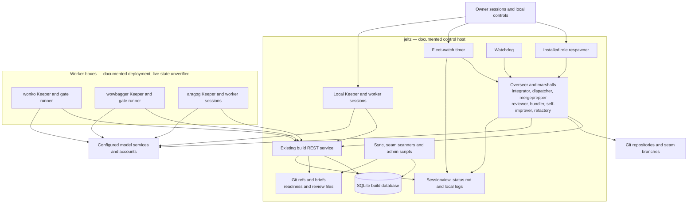
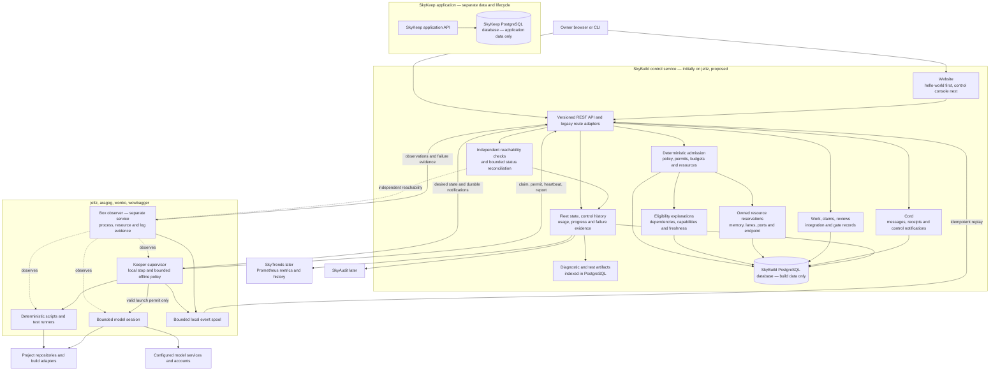
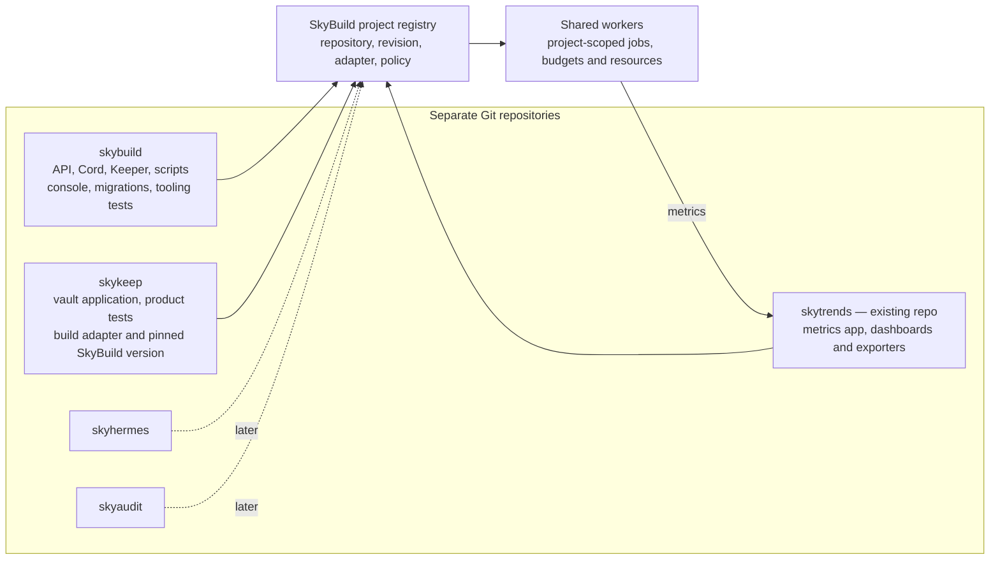

# SkyBuild — architecture and staged project plan

## 1. Current architecture

**Draft for owner review, revision 2, 2026-10-08, America/Chicago.** This expands and supersedes the Cord-only release plan. It proposes work; it does not start services, file new todos, migrate data, or authorize autonomous execution. The owner reports the build environment stopped after a large weekly usage decline. Current remote process states are unverified. The launch inventory establishes overlapping control paths, not the cause or amount of billed usage.

### Current functions and placement

| Function | Current component and location | Responsibility and current control boundary |
| --- | --- | --- |
| Work inventory | Todo REST service on jeltz; SQLite | Items, priorities, dependencies, questions, state/history, claims and heartbeats. Keepers pull work. |
| Intake and synchronization | Sync/import/admin scripts on jeltz | Import briefs from pushed Git, update work records, scan seams. Some paths access Store directly. |
| Worker execution | Keeper on jeltz, wonko, wowbagger; aragog when provisioned | Claim a task, create a worktree, launch an engine or shell worker, monitor resources and usage, report results, recover short sessions. |
| Worker lifecycle | Keeper commands, STOP/DRAIN files, systemd and keeper_ensure | Local stop and drain exist. The ensure process can start an inactive Keeper; runtime process termination alone is not durable disablement. |
| Work allocation | Dispatcher marshall on jeltz | Adjust priorities, holds and per-box Keeper settings. Settings and spawn permissions currently have several owners and mechanisms. |
| Integration preparation | Mergeprepper and codereviewer on jeltz | Check precise seam tips, review, prepare/rebase seams, record readiness. Existing scripts enforce evidence and claims. |
| Integration | Integrator on jeltz, with distributed gate runners | Own the integration lease, select a batch, merge, verify, update the ledger and complete the batch. Full product lanes and tooling checks have different policies. |
| Bundle execution | Bundler on jeltz and its checkouts | Group related work, build bundles, resolve verification failures and hand off results. |
| Build maintenance | Self-improver, refactory, unblocker/fixer roles where configured | Diagnose blockers and propose or carry out assigned improvements. Availability differs between role briefs and installed launchers. |
| Role supervision | Overseer and installed respawn scripts on jeltz | Inspect role files, logs and process records, relaunch finite runs, publish status. |
| Independent recovery | Fleet-watch timer and watchdog on jeltz | Probe conditions and independently launch integrator, dispatcher or diagnosis/resume sessions. |
| Cross-box coordination | REST plus skybus Git refs and stream notes | Work claims, messages, gate slice/evidence exchange, fallback status and lease information. |
| Visibility | Sessionview, fleet endpoints, usage polls, local logs, status.md | Display pieces of process, work and resource state. Freshness and authority are uneven; no demonstrated universal admission gate. |
| Infrastructure | aragog start/stop scripts; lane and endpoint scripts | Provision/stop the metered worker, allocate test stacks, check memory and endpoint conditions. These are distinct from paid model quota. |
| Source and deployment | Main checkout, separate roles checkout, todo-live checkout and host-installed scripts | Code, role instructions and deployed executable versions can differ. Record all of them, not merely the repository branch. |

This is an inventory of functional families, not a claim that every installed cron entry was accessible. Sources and per-file anchors are in [current inventory](../../../skykeep/docs/design/skymaker_current_inventory_20261008.md) and [migration inventory](../../../skykeep/docs/design/skymaker_migration_inventory_20261008.md). A deterministic executable/route/unit census is a completion condition before cutover.

### Evidence that changes the design

The installed role respawner, fleet-watch and watchdog each provide a model-launch path. A pause in one does not establish a global stop. Keeper has additional restart paths. Logs contain repeated integrator starts, including a near-minute pattern earlier in the UTC day and later launches about 15 minutes apart. They also show at least one completed integration. Do not label every restart wasted or attribute the owner's weekly quota decline without session/provider accounting.

The inspected source baselines differ: main checkout `383d3d375`, roles checkout `fde9bd6fc`, and todo-live `1c314af98`. These are inspection snapshots, not promises of the live versions at implementation time. The v19 service has 27 tables; `/dump` exports only a subset. Source code, unit configuration and observed processes must be reconciled before deployment. The sandbox could not query the user systemd bus or crontab, so their present enabled states remain unknown.

## 2. Product identity and goals

Revision 2 records the owner's product name **SkyBuild** and existing repository choice. Earlier inventory/report filenames retain the previous working name as historical evidence. All proposed task IDs below now use `SKYBUILD-`; none has been filed by this plan.

**Stonesky** is the application suite. **SkyBuild** is its build system and owns Keeper, integration, build coordination, launch control and build visibility. **Cord** is SkyBuild's durable messaging capability. **Keeper** remains the name of the remote worker component.

SkyKeep is the vault application. SkyHermes is a Hermes instance that can call SkyKeep. SkyAudit provides secure auditing. SkyTrends gathers metrics; its existing repository is currently small. The owner has confirmed that a coworker created the dedicated [SkyBuild repository](https://github.com/stonesky-ai/skybuild). Use this repository for the build product. Cord and Keeper retain their names. Historical Dark Build Factory proposals are research inputs; neither that repository nor SkyTrends is being repurposed. Repository contents have not been inspected during this rename.

The immediate outcome is a system the owner can inspect and stop before further uncontrolled model consumption. In the next two days, only explicitly selected work should proceed. Abundant CPU should perform routine discovery, polling, validation and recovery. Models should do bounded work that requires reasoning or code generation.

Success means every managed model run answers: what is it doing, on which box and repository, which task authorized it, who started it and through which launcher, which instructions/code version it uses, what it consumed, why it stopped, and what could restart it. Unknown values are visible. A failed prerequisite should usually cost zero model tokens because a script checks it before launch.

## 3. Proposed runtime architecture

Reuse the current FastAPI service and shared client where practical. Give the deployed service a clear SkyBuild identity and a versioned API; the first implementation deliverable is its hello-world website plus health/version/database readiness. That skeleton performs no worker launch. Preserve legacy build routes through the same service while converting all persistence to PostgreSQL. Avoid two writable services or a permanent SQLite/PostgreSQL split.

**Confirmed owner requirement:** SkyBuild's PostgreSQL database is a different database from SkyKeep's PostgreSQL database. SkyBuild stores build/control data; SkyKeep stores application/vault data. A separate schema inside the SkyKeep database does not satisfy this requirement. SkyBuild has its own database identity, credentials, migrations, backups and lifecycle, also separate from disposable test databases. The SkyBuild service role has no authority to migrate or alter the SkyKeep application database. Whether the databases share a physical host or PostgreSQL server is a later deployment choice, not permission to share a database. Initial SkyBuild hosting on jeltz is a proposal requiring availability confirmation; aragog's interruptible worker lifecycle must not accidentally determine control-service availability. All addresses and limits are configuration.

Cord communicates durable facts and requests. Start/stop authority resides in authenticated, transactional control records; arbitrary message prose cannot authorize execution. Writing a control change and its notification uses one transaction/outbox. Current status is a projection of control and run records with freshness, not a concatenated status file. Git remains authoritative for source and commits; model transcript files remain local artifacts with bounded references.

### Inventory, state and provenance

Represent separate dimensions rather than one overloaded process status:

| Dimension | Required values or facts |
| --- | --- |
| Identity | Stable box, component, project, run and parent-run IDs; boot/session identity; PID with process start time; worktree; engine/model actually used; deployed code and brief digest. |
| Desired state | Enabled, disabled, draining, or shutdown requested; scope can be fleet, project, box, role or run. |
| Observed state | Unknown, stopped, starting, running, draining, exited or failed; last heartbeat and observation source. |
| Admission outcome | Allowed or denied, with structured reason: disabled, budget, lease conflict, no eligible work, memory/disk, endpoint unavailable, stale telemetry or incompatible version. |
| Restart behavior | Retry count, next eligible time, backoff/circuit state and exactly which supervisor may restart it. |
| Provenance | Authenticated actor, local/central source, reason, request ID, originating policy/schedule, generation, time, parent cause and superseded instruction. |
| Usage | Measured input/output/cache tokens where available; estimate and source; provider/account quota snapshot and timestamp; authorized reservations; unattributed usage explicitly shown. |
| Progress | Run/phase start, elapsed time, last meaningful progress, current operation or test, completed/total units where known, and declared wait with its deadline. |
| Failure evidence | Exit code/signal, exception or traceback references, OOM evidence, scope/unit result, retry/reset time, classification confidence and artifact completeness. |
| Observation health | Reporting observer, process identity, observed/received times, freshness, probe result, conflicting evidence and observer's own health. |

The first console shows a box/component table, current jobs, start/exit loops, stale/missing boxes, authorization history, usage freshness and the next permitted action. It offers global pause-new-work, drain and local-state inspection through the same API/CLI. Clicking a refused start explains why and identifies its launcher. A stopped process can still be enabled for restart; both facts must be visible.

### Every component is observable, including its observer

**Confirmed owner requirement:** every managed component has a queryable status contract and a defined source of independent evidence. This includes the REST service, database, Cord delivery worker, Keeper, individual agent attempts, integration and gate runners, scanners, scheduled scripts, and observers. Long-running jobs expose progress and diagnostic artifacts, not merely a PID or heartbeat. The component registration declares its observer, status adapter, meaningful progress signals, expected waits, artifact locations and version. A legacy component can satisfy the contract through a wrapper without first being rewritten.

Use one lightweight **box observer** as the default, in a separately supervised process outside the worker's resource scope. It reads process/unit/container state, resource counters, session metadata and bounded log changes through adapters. Components also emit structured progress and results when possible. A dedicated sidecar is appropriate when a component needs specialized collection; an in-process thread can emit progress but cannot report after its host is killed. Neither a thread nor a child killed with its parent's scope is sufficient as the only death detector. The independent observer detects disappearance and collects surviving evidence.

The control service independently checks observer freshness and box reachability. A missing heartbeat means `unreachable` or `unknown`; it does not prove the host died. A reachable observer with a missing process provides stronger evidence of process death. Boot identity changes establish reboot; accessible supervisor/kernel records may establish OOM. An external lightweight check on another enrolled box detects loss of the control service; local status/stop remains usable during that outage. Observers have their own last-seen and failure records. Do not create an infinite chain of watchers or give every watcher restart authority.

| Observation | Evidence to collect | Interpretation and permitted response |
| --- | --- | --- |
| Box stops reporting | Heartbeat age, independent reachability, observer probe, boot identity on return | Show unreachable with last-known facts; fence new admissions. Do not assume processes stopped or reassign irreversible work without fencing/reconciliation. |
| Process exits | Stable process identity, exit code/signal, supervisor result, terminal event if present, bounded stderr/traceback references | Record the attempt as ended; distinguish completed work, expected refusal and crash. Preserve evidence before cleanup or replacement. |
| OOM or resource exhaustion | Available cgroup OOM counters/events, supervisor/container termination reason, kernel evidence and resource samples | Classify as confirmed or suspected and name the evidence. Exit 137 or SIGKILL alone does not prove OOM. Broader host OOM may affect several components. |
| Usage/rate limit | Structured provider/adapter error, affected account/model, response time, retry-after/reset time and freshness | Show an explicit waiting state and earliest eligible retry. No polling with model calls. An unknown reset time remains unknown; a later timestamp still requires a fresh admission check. |
| Alive but possibly stuck | Current phase/test, elapsed duration, progress sequence/counters, log/session changes, CPU/I/O deltas and declared wait | CPU activity or growing logs alone do not prove useful progress. A quiet network wait is not automatically a hang. Flag suspected stall against phase-specific expectations and request a bounded diagnostic probe. |
| Observer or telemetry failure | Collector exit, failed reads/permissions, lost event range, spool fullness and stale timestamps | Show degraded observation and missing evidence explicitly. Do not report healthy or zero usage from absent data. New paid launches require adequate observation coverage. |

Expose a cheap cached status read and a distinct bounded fresh probe. Proposed contracts: `GET /api/v1/components/{id}/status`, `GET /api/v1/runs/{id}`, `GET /api/v1/runs/{id}/artifacts`, and authenticated `POST /api/v1/components/{id}/probe`. A fresh probe returns a request ID; its result reports what was observed and what could not be checked. The probe invokes an allowlisted adapter, never arbitrary shell text or an LLM. Dashboard refreshes read cached records rather than repeatedly spawning diagnostics.

Each observation includes source, box boot ID, run/attempt identity, monotonic per-source sequence, observed time and server-received time. Use a monotonic clock for local duration; preserve wall-clock timestamps for correlation and expose suspected clock skew. Reconcile process records, component self-reports and observer evidence; show conflicting or stale sources instead of accepting whichever message arrived last. PID reuse cannot attach an old job's health to a new process. Sample intervals, freshness limits, resource overhead and probe concurrency are configured and bounded.

### Failure preservation and restart decisions

Create a failure record per attempt containing the structured reason, last phase/progress, exit metadata, traceback or stderr artifact, nearby resource/observer evidence, provider limit details, code/brief/configuration fingerprints and the previous related failure. Group repeated failures with a stable diagnostic signature; retain attempt history and counts. Logs and test outputs are untrusted data and cannot issue control instructions.

The observer writes a bounded local durable event/artifact spool during network loss and replays it idempotently. PostgreSQL stores indexes, summaries, checksums, sizes and retention state; larger logs, tracebacks, coverage files and reports live in a configured artifact directory initially, with remote copying when available. Store enough evidence outside the transient worktree before cleanup. If a box disappears before upload, show evidence as unavailable or partial rather than claim it was preserved. Redact credentials and bound collection, disk use and retention; record truncation or collection failure explicitly.

Admission consults the failure record before relaunch: a repeated unchanged traceback opens the circuit; OOM requires evidence that the resource condition changed; a usage limit waits until the applicable reset/admission check; an operator stop remains stopped. Deterministic diagnosis may run under its own small CPU/time allowance. Paid analysis or a paid replacement run still needs the selected work-window authorization. A watcher reports evidence and requests an action through the central policy; it does not independently create another restart loop.

### Integration and test result contract

Wrap existing test/lint runners with a shared result adapter. Preserve their current product verification policies and failure rules. Emit run, phase and test start/finish events with project, source revision, suite, test identity/parameters, attempt, worker/lane, start time, duration and outcome. Display the current test and the last completed test, plus completed counts and total count when discoverable. Parallel output is associated through IDs rather than guessed from interleaved text.

Capture assertion errors, setup/teardown errors, collection failures, process crashes and infrastructure interruptions distinctly. Keep the full diagnostic artifact with a bounded error summary and a link to the exact test/attempt. A failed test is not relabeled as infrastructure merely because the runner also encountered a problem. If the runner is killed mid-test, mark that test/run interrupted or incomplete with the available evidence; never invent a passing verdict or complete totals. Retried tests retain every attempt.

Import the runner's existing structured results, such as JUnit reports, and reconcile them with streaming events and process exit. A run is finalized only after its expected result manifest is checked; missing reports or disagreement are visible. Collect coverage totals and per-file/report artifacts when coverage actually ran, including source revision, measurement scope and completeness. Coverage is `not collected` or `incomplete` when appropriate, never inferred as zero. Record pylint or other configured lint output as a separate linked step/tool result with tool version, invocation fingerprint, messages and exit status. Do not run an extra linter on every test solely to populate a panel.

The console provides a run timeline, elapsed/current-phase duration, time since useful progress, test results, coverage/lint availability, resource evidence and restart reason. Useful progress thresholds depend on phase and workload; historical durations can guide warnings but do not silently extend deadlines or authorize a model relaunch. Start with status/progress/error capture and existing reports; deeper coverage instrumentation and richer analysis follow without delaying basic failure visibility.

### Launch and stop rules

All managed launchers, including legacy cron, timers, watchdogs, role respawners, Keeper ensure paths and nested workers, use one admission client. A request names the job, project, model size, account, resource needs and parent run. Scripts check eligible work, versions, memory and required service/lease conditions before obtaining a short-lived, single-use launch permit. Permit reservation and concurrency/budget checks are atomic. Repeated delivery cannot start a second run.

Do not wake a model to ask whether it should run. An integrator launches only when deterministic readiness checks show an actionable integration set and the correct lease can be obtained. Expected denials become cheap state updates. Unexpected repeated exits trigger backoff and then a circuit that requires a changed prerequisite or an explicit reset. A periodic tick alone never resets that circuit.

Every restrictive control applies: a central enable cannot clear a local disable, and a local enable cannot override a central pause or exhausted budget. Record conflicting instructions and the effective result. Updates use monotonic generations; stale enables and replayed commands fail. Disablement survives process and machine restarts. Reinstall/ensure scripts must not bypass it.

Proposed default pending interview: stop admitting work immediately, finish only a bounded safe step, checkpoint, then stop. A normal drain, emergency termination and host shutdown are distinct operations with named deadlines and outcomes. Critical Git/database operations require explicit recovery handling; they must not claim indefinite exemption. During disconnection, a Keeper admits no new work, buffers bounded telemetry and follows its already issued permit's expiry/checkpoint policy. Reconnection does not erase a local stop.

### Spend control without false precision

Proposed two-day default: one owner-selected work window, named task allowlist, one paid model run at a time, no automatic paid retries, and an expiring authorization. CPU scripts may run concurrently within host resource limits. Budget and launch caps are enforced before any restart or child session, not only when a task is first assigned. Actual numeric allowances remain unset until the owner chooses them; this plan authorizes none.

Track hosted quota, token counts, money and CPU/VM usage separately. Subscription percentage is not necessarily a linear token balance, and percentages from different providers cannot be added. Derive session usage carefully from cumulative counters and deduplicate repeated reports. Attribute usage to project/job/attempt/model/box/account, including failed starts that reached a model and nested calls. Show estimated, confirmed, reserved and unknown amounts separately.

A wrapper can enforce managed launch count, concurrency, deadlines and supported per-call limits. It cannot promise an exact universal weekly-token ceiling when a vendor reports late or a CLI has no enforceable token cap. Reserve conservative headroom, stop new work on stale/unknown accounting, and show the remaining in-flight exposure. Observed unmanaged sessions are flagged; a product cannot claim to control arbitrary account use outside enrolled launchers. The initial operator view must expose this coverage gap.

## 4. PostgreSQL migration and early data pull-over

Full existing build API migration is an early milestone, before broad worker resumption. This supersedes r3's decision to move only mailbox tables. Preserve route behavior and data semantics while changing the store; do not redesign every domain at the same time.

The source is the build tooling's SQLite store. The destination is the dedicated SkyBuild PostgreSQL database. SkyKeep's existing PostgreSQL application database is outside this migration. Provisioning, importer and deployment preflight must verify the target database identity and refuse a SkyKeep application or test database; the SkyBuild role must lack access to those databases.

The inspected v19 baseline contains these groups; implementation must enumerate the actual frozen schema rather than assume it still has 27 tables:

| Domain | Tables in inspected baseline |
| --- | --- |
| Work and history | schema_version, items, item_history, claims, seams, events |
| Review and integration | seam_scan, integration_sets, priority_overrides, alarms, item_marks, set_marks, reviews, seam_state, seam_fact |
| Fleet and settings | component_events, component_status, box_settings |
| Batch and gate | batch_run, batch_step, gate_runs, gate_jobs, gate_results |
| Memory, lease and messaging | lessons, integrator_lease, integrator_messages, integrator_message_handled |

1. **Inventory and preserve early.** Pin the deployed code/schema and list every REST route, SQL-using module, direct writer, timer, local configuration reference and sidecar authority. Take a consistent SQLite backup using SQLite's backup mechanism and record schema, per-table counts and hashes. Retain Git refs/briefs, readiness JSON and review artifacts with a manifest. `/dump` and a bare copy of the WAL-backed database are insufficient. Do not include secrets in manifests.
2. **Build and rehearse against that data.** Provision dedicated PostgreSQL, port the complete store and direct SQL callers, and run the importer against a disposable target. Preserve IDs, Unicode/text, attribution, history, dependencies, replies, receipts, timestamps and JSON semantics. Validate foreign keys, counts, canonical values, sequences and domain invariants. Preserve an untouched source snapshot; an idempotent importer refuses a different snapshot or unrelated nonempty target.
3. **Prove concurrency and API compatibility.** Replace SQLite locking/SQL assumptions deliberately. Test competing claims, stale renewals, singleton integrator ownership, gate-job allocation, message deduplication/handling and rollback after failure. Existing `BEGIN IMMEDIATE` serialization must not silently become unsafe concurrent PostgreSQL updates. Cover direct Store users as well as HTTP routes. Confirm no runtime build API domain still writes SQLite.
4. **Freeze all writers for final cutover.** Reconcile actual running jobs; the owner's stop report is not a substitute for checking remote processes. Stop/fence old API writers, sync, scanners, admin tools and obsolete launchers. Take the final consistent snapshot and sidecar manifest. Import and validate before making PostgreSQL writable to clients. Imported enabled settings never automatically restart the fleet.
5. **Switch one authority.** Launch SkyBuild with compatible old routes and the new routes over PostgreSQL. Legacy SQLite is retained as recovery evidence and cannot accept writes. Preserve historical claims but mark/reconcile their liveness explicitly; increment the control generation so old permits and stale processes cannot resume work unnoticed. Do not silently rewrite prior history.
6. **Prove a restricted restart.** Exercise authenticated work, fleet, messages, lease and gate-record paths with controlled test records, restart the service and verify persistence. Admit only the selected bootstrap component after control acceptance. Before first PostgreSQL production write, rollback may restore the frozen source and old code. After that boundary, PostgreSQL stays authoritative and recovery uses compatible code or an explicit tested reverse migration; never silently reopen stale SQLite.

External Git and artifact stores remain explicit authorities initially. Inventory/hash their cutover state and retain compatibility readers. Migrate scattered control/status files into SkyBuild records as components adopt the API; do not pretend a relational import absorbed them. Future SkyAudit and SkyTrends integration is additional export, not a prerequisite for durable control history.

## 5. Cord contract and deterministic execution

Retain sender, recipient, subject, category, urgency, project, immutable message ID, accepted time, reply/thread links, structured task/run references, idempotency key and optional expiry. Categories include request, decision, handoff, review, blocker, incident, status, result, capacity and misc. Urgency affects presentation/escalation, never authority. Distinguish accepted, delivered/claimed, handled and replied.

Use PostgreSQL delivery claims with expiry and fencing; poll pending records in bounded batches. A sequence ID is identity, not proof that lower IDs committed first. A retry uses the original idempotency key; conflicting reuse fails. Replying does not silently handle the original. Transactional handling and target-side idempotency are required for effects; do not promise exactly-once external execution.

Canonical Cord routes remain under `/api/v1/projects/{project_id}/cord`. Proposed fleet, control and run APIs are under `/api/v1`; legacy `/items`, `/queue`, `/integration`, `/gate`, `/fleet` and `/integrator/messages` remain compatibility entry points while callers move. Final schemas belong in one generated OpenAPI/client contract, not independently written prompt instructions.

Durable notifications, routing, status collection, usage collection, eligibility checks, retries and drains use scripts. A small authenticated client supports Python and shell. Skills explain when to invoke a command and how to interpret its short result; they do not restate a long manual algorithm every time.

## 6. Seven-day log review and token reduction

Reuse the existing `TOOLING-TOP-20-SKILL-SCRIPT-COMBOS-FROM-SESSION-LOGS` work and inspect the existing `seam/LOG-REPEAT-SCANNER` artifact before creating more work. The scanner worktree already contains `scripts/agents/session_mine.py`, documentation and tests. Its landing/completion state is unresolved. Finish this review as early preparation; the hello-world endpoint remains the first implementation deliverable. A full seven-day report must not block the first control safeguards.

The review must be a streaming CPU job over the preceding seven days, with an explicit cutoff, provider coverage, skipped-file counts and timezone. Extract invocation metadata, outcomes and available usage; normalize commands without exposing credentials; cluster repeated workflows and repeated failed starts. Distinguish duplicate log entries, intentional health checks and useful repeated tests from waste. Do not send full transcripts to any model.

Produce counts, confidence, estimated avoidable context/output and concise candidate descriptions. Rank scripts by repeated manual/model effort and implementation cost. Include exact sample references with bounded, redacted excerpts only when needed. Proposed first report limits are 20 candidates and at most 3 short examples per candidate; select only a few high-value changes for the first release. These are review limits, not unlimited analysis invitations.

Use deterministic tests to confirm a replacement command's inputs, refusals, output and recovery. Optional configured local inference on llm.brodson receives only a small redacted candidate batch after confirming availability and suitability. No fallback to a paid model without its existing budget permission. A script schedule may refresh the report incrementally; an LLM should not repeatedly reanalyze unchanged logs or file todos automatically.

### Fans-on lessons: explain inactivity before attempting recovery

The [Luna failure-lessons review](../../../skykeep/docs/design/skymaker_failure_lessons_20261008.md) distinguishes observed problems from risks described by the skill. The retained seven-day brief reports 266 Claude JSONL files and 27,355 tool calls, but no separate retained failure/frustration report or aggregate miner output was located. Its command categories overlap and its token figures are character-based estimates, not billed usage. This evidence justifies consolidating repeated inspection; it does not prove which commands failed or caused the owner's weekly quota loss. Preserve that gap rather than relabeling hypotheses as incidents.

| Retained seven-day finding | Architectural response |
| --- | --- |
| 6,833 log-tail calls; 1,625 test-run calls | One run/result reader supplies concise progress, failures and exact artifact references from structured records. Detailed output is fetched only on demand. |
| 2,927 process inspections; 1,633 unit-state calls; 3,380 box-status calls | One box observer and shared status cache collect evidence once. CLI, website and skills use that same record, with a bounded fresh-probe option. |
| 950 usage inspections | One deterministic account-usage collector supplies timestamped data to admission and display. Per-role model sessions do not reread and reinterpret quota files. |
| 724 lane inspections; 1,086 seam summaries | Owned resource records and deterministic seam eligibility replace repeated manual reconstruction. Inspection is read-only; cleanup and integration remain separate controlled actions. |
| 4,265 Git-state calls; 862 helper-agent brief calls | A cached repository snapshot and deterministic brief assembler supply the pushed revision, scope, instructions and digest. Refresh on relevant changes; avoid loading an entire plan into every helper. |

Implement these as adapters and commands over shared collectors/state, reusing working scripts first. Thin skills point to a command and explain its refusal codes. Twenty recorded command patterns do not require twenty new services or twenty new todos. Script summaries preserve incomplete/error states and links to full evidence; compression must not hide a failure.

The `fans-on` skill provides an ordered diagnosis of idle workers: eligible work, unmet dependencies, Keeper state, fresh usage evidence, resource reserves, lease/lane ownership, connectivity and source-scan freshness. Encode this as a deterministic explanation API, using the same predicates as actual admission. The response names every blocking condition, its evidence and freshness, which actor can resolve it, and the next meaningful check. Do not implement a separate dashboard eligibility algorithm that can disagree with the scheduler.

Deliberate pause, empty authorized queue, necessary resource reserve and waiting for a usage reset are legitimate idle states. The older instruction to make every box busy is superseded by the owner's controlled-spend direction. The newer skill also says jeltz runs no jobs: the target configuration excludes jeltz from build-worker allocation, while retaining only its explicitly permitted control/observation and coordination services. Historical jeltz worker deployment in the current-state diagram is not a proposal to restart it. Aragog provisioning remains explicitly controlled; spare capacity does not authorize a metered VM start.

Prevention belongs in the data and admission model:

- **Capability mismatch:** validate task model size, runtime, project adapter and required lane/endpoint against registered capabilities before assignment. Explain an unschedulable task; do not repeatedly send it to the same incompatible worker or silently widen its model mapping.
- **Dependency blockage:** validate dependency references and reject newly introduced cycles. Show the unlanded prerequisite, its owner and its own blocker; distinguish ready-to-integrate work from executable work. Do not create fake shell tasks merely to fill a box or automatically change owner priorities.
- **Resource contention:** reserve memory, lanes, ports and exclusive endpoint use against stable run ownership in one admission transaction. Measure pressure, swap and resource headroom as well as CPU load. Do not lower reserves or raise slot counts merely because a box looks idle. Reconcile declared reservations with observed resources and quarantine conflicts.
- **Abandoned claims and leases:** attach attempt/generation ownership and expiries; recovery requires fencing and evidence that reexecution will not duplicate external effects. A network outage is not proof the previous holder died. Show the blocking holder and last observation instead of blindly releasing its claim.
- **Stale usage or scans:** publish source timestamps and explicit collection errors. Refresh with a bounded script; unknown usage remains a paid-work stop. A stale readiness scan triggers one deduplicated refresh, not repeated model launches on stale queue contents.
- **Deployment drift:** record compatible service/client/brief versions and configuration generations. An ensure/update action installs a pinned version and preserves disablement. It cannot opportunistically pull a different trunk and then resume work without the current admission policy.
- **Leaked artifacts or stacks:** record the creating run and exact resource identity at creation. Cleanup requires expired ownership, protection checks and retained diagnostic evidence. Never infer ownership solely from a directory name, age or Docker project name; never touch another live session's stack or the application vault.

Recovery is an allowlisted, bounded script with preconditions, an idempotency key, a per-cause cooldown, an attempt limit, a postcondition and an audit record. Examples are refreshing a stale read, retrying a read-only probe, uploading queued evidence or restarting a permitted non-model collector after its fault clears. Model-bearing restarts still require a launch permit; changes to stop state, budget, capacity policy, credentials or work priority need the relevant authority. A failed recovery opens a visible circuit rather than escalating automatically to paid diagnosis. Success means the intended state and useful progress are observed, not merely a zero exit code or higher CPU load.

Enforce invariants below prompts: database uniqueness prevents duplicate action ownership; conditional updates reject stale control generations; resource records reject overlapping reservations; the admission predicate rejects incompatible tasks; clients refuse unsupported protocol versions. Prompts explain these rules but cannot waive them. Record denial counters and reasons without producing a message or a log dump on every unchanged poll. Both observation and recovery have CPU, I/O, disk and retry bounds so a token-free script cannot become a new resource storm.

## 7. Keeper adoption and aragog bootstrap

Proposed default: adapt the existing Keeper through the shared client, preserving its worktrees, engine adapters, shell-worker support, heartbeats, resource checks, local STOP/DRAIN, graceful shutdown, and update behavior. Simplify its execution loop only after the control contract works. Admission applies equally to paid sessions, resumed sessions, nested helpers and autonomous marshall launches.

Inventory aragog's existing sessions before reuse: run IDs, claimed task, worktree and branch, actual engine, process state, outstanding changes and remaining authorization. Reattach only when ownership and compatibility are proven. Otherwise preserve the worktree/checkpoint, close or reconcile the stale claim and start a separately authorized attempt. A session name or old PID is not proof of a living, resumable worker.

Before the new API exists, an existing aragog Keeper may be used only as a proposed bootstrap executor for a specifically approved SkyBuild packet, through a manual one-shot path with automatic claiming/respawn disabled. Do not enable the old fleet to build its replacement. This planning document does not authorize that start. Existing sessions can also be preserved idle until the new admission service is ready.

After control acceptance, enroll aragog first as a canary: report-only startup, one CPU task, one explicitly authorized bounded model task, local and central drain tests, connection-loss test, and restart without unintended work. Record how STOP/DRAIN interact with its VM shutdown. Then adapt jeltz's launch paths and roll to wonko/wowbagger in one coherent adoption batch. A legacy launcher that cannot enforce permits remains disabled.

Enroll the box observer before any canary job. Exercise a killed worker and lost observer connection, verify the independently reported failure and preserved artifacts, and prove the unchanged failure cannot trigger repeated model starts. Keeper reports job/phase progress and provider waits; test runners report structured test results through the same run identity. The observer must remain able to report after a worker's resource scope is terminated.

Updates follow: request drain; stop new claims; reach a checkpoint or report why the deadline cannot be met; report drained; apply a pinned artifact; verify version and health; remain disabled until the applicable control state permits work. Update failure preserves the stop and recovery information. Aragog's compute spend and llm.brodson capacity remain visible separately from hosted tokens.

## 8. Dedicated SkyBuild repository from the start

Begin the planned implementation in `https://github.com/stonesky-ai/skybuild`. Maintain this plan in SkyBuild under `docs/design/`, with the sibling SkyKeep checkout retaining its supporting evidence. Relative evidence links assume both checkouts are under the same workspace directory; those evidence files are not included in this initial document commit. Repository setup, this documentation move and its commit are authorized. Code extraction, implementation, service starts and migration still require explicit authorization.

When implementation is authorized, establish the minimal SkyBuild service in its repository, then move the existing build API and its tests as a coherent component with behavior preserved. Keep the mechanical move distinct from the PostgreSQL conversion so failures can be attributed. Move Keeper and shared tooling incrementally, preserving history where practical and leaving thin compatibility commands in SkyKeep until callers migrate. Each deployed SkyBuild version is pinned; cross-repository compatibility is tested through a small versioned project adapter. Product repositories retain their source, product tests, secrets/configuration and build contract. Product-specific lane commands and Git policies are adapter configuration, not SkyBuild literals.

Use immutable project IDs now, register SkyKeep and SkyBuild as separate repositories, and record repository/revision for every job. Work inside each repository still requires ordinary worktree/file coordination. Concurrent autonomous building across multiple repositories comes later, after project-scoped authorization, claims, worktrees, resource reservations and budget fairness are tested. A brief's requested model size is vendor-neutral; runtime selection and actual model/account are separate auditable facts.

SkyTrends can later consume SkyBuild metrics through an exporter; existing Prometheus work should be reconciled before duplication. Metrics storage does not become the authority for start/stop or work ownership. SkyAudit can receive control/audit events later without making initial controls depend on its availability. The existing `dark_build_factory` repository remains historical research for this plan. The repository choice is settled: `stonesky-ai/skybuild`. SkyTrends keeps its metrics-product identity.

## 9. Delivery plan and proposed tooling packets

Keep one parent plan and a small number of coherent work items. Use short bounded implementation assignments inside each item; do not create a todo for every route, table, caller or test. Check existing item IDs and completion history before filing. The rows below are proposed, not filed. Existing log-mining work is reused.

| Proposed item | Dependencies | Scope and completion evidence | Model size |
| --- | --- | --- | --- |
| SKYBUILD-FOUNDATION | Owner approves scope and deployment location | Establish the service in the existing `stonesky-ai/skybuild` repository; named endpoint, hello-world site, version/health/PostgreSQL readiness, declared service boundary and component status contract, no worker side effects; source/writer census and early consistent backup manifest. | Small for thin site; medium for existing service boundary. |
| SKYBUILD-POSTGRES-CUTOVER | Foundation; snapshot and writer census | Move existing build API/tests coherently into SkyBuild with behavior preserved, then separately perform the entire API/direct-writer store port, all-table importer and rehearsal, concurrency/API compatibility, frozen cutover and recovery proof. SQLite no longer a runtime authority. | Medium implementation; one bounded large review of transaction/cutover design if needed. |
| SKYBUILD-CORD-CONTROL | PostgreSQL store contract; cutover before activation | Durable Cord; fleet inventory, desired/observed state, provenance, launch permits, shared eligibility explanations, owned resource reservations, usage reservations/freshness, component/run/probe APIs, failure/artifact records, global pause/drain, minimal console and failure-loop circuit. No paid task admitted without evidence. | Medium; script-only runtime. |
| SKYBUILD-KEEPER-ADOPTION | Cord/control; approved launch window | Preserve Keeper abilities, enroll independent box observers, reuse/reconcile aragog sessions, gate every old launch path, progress and traceback capture, initial integration/test result adapter, canary and failure tests, staged box enrollment, versioned update/drain behavior. | Medium; small for bounded client adapters. |
| SKYBUILD-SCRIPTED-OPERATIONS | Existing seven-day mining review; new control client | Convert highest-value repeated routines into shared collectors/commands and thin skills; add bounded recovery rules with postcondition checks; consolidate supervision, deterministic readiness and reporting; expand runner/coverage/lint artifact adapters and component observation coverage; remove superseded model-driven polling and duplicate restart logic after coverage proof. | Small/medium per accepted patch; no model in recurring runtime. |
| SKYBUILD-MULTIPROJECT | Controlled operation and adapter contract | Complete remaining tooling extraction, pin adapters in SkyKeep and SkyTrends, prove concurrent project isolation, add metrics/audit exports and shared resource fairness as warranted. The dedicated SkyBuild repository and initial API extraction are earlier work. | Medium; later, outside initial two-day focus. |

For each packet, a compact brief names exact files, fixed interfaces, denial-first acceptance cases, one output artifact and a bounded correction allowance. The model doing review/analysis does not also make implementation edits. Select the smallest effective size; record the actual engine/model at execution. Use llm.brodson only when a small representative task proves it useful and authorized capacity is available. No recursive agent fanout.

**First work window:** validate shutdown/control coverage, perform the bounded log census, deliver the hello-world endpoint, inventory and back up the whole current database, and begin the PostgreSQL rehearsal. **Next work window:** finish the full port/cutover proof, implement Cord/control visibility, and admit at most the chosen aragog canary after those checks pass. These are ordered targets, not a promise that a full port fits two calendar days. If the port is larger than expected, preserve the shutdown and a useful visible endpoint; report the remaining packet rather than resume uncontrolled work to meet a date.

Reduce integration overhead: combine compatible service/schema work into one planned service cutover, then use one adoption release for clients/launchers. Keep small reviewable commits within those releases and preserve testable intermediate states. Deployment can precede normal merge reconciliation under the owner's tooling policy, but the exact deployed artifact/hash and eventual commits must be recorded. Do not wait for product testfast/testgates for tooling changes. Run affected tooling tests, disposable PostgreSQL tests and the service/restart double-check. No tests against the live customer vault.

## 10. Acceptance cases that prevent another opaque burn

1. A disabled fleet remains disabled after reboot, Keeper ensure, watchdog tick and an old enable message. The UI names the decisive stop and actor.
2. No eligible integration or a failed resource prerequisite launches zero model sessions. Repeated failure opens a visible circuit rather than repeatedly loading a prompt.
3. Competing launchers obtain at most one permit for the same action. All child attempts share the correct budget accounting and require authority.
4. A stale provider usage snapshot blocks new paid work. UI displays unknown exposure and in-flight reservations rather than zero usage.
5. A disconnected Keeper admits no new work; its current run checkpoints/stops under the selected policy. Reconnect preserves local disablement.
6. A local stop, central drain and machine shutdown each yield an auditable progression; protected operations either finish within policy or expose a recovery blocker.
7. The migration preserves every source table and defined external authority; claim/message concurrency and API behavior pass against PostgreSQL. Service restart loses no accepted message or control action.
8. Every observed managed process links to its box, job, parent, instruction/code versions, authorization and usage source. Missing or unmanaged processes remain visibly unknown until reconciled.
9. Aragog completes a bounded task through the new API, drains for update, reports its new version and stays stopped when disabled.
10. Periodic reporting and health checks work with every model endpoint unavailable. No routine status path needs an LLM.
11. SkyBuild migrations/imports refuse a SkyKeep application or test database target. Separate database credentials and permissions enforce the boundary; restarting or restoring SkyBuild does not migrate or restore SkyKeep's application database.
12. A killed worker is detected independently of its own heartbeat thread. OOM attribution uses supporting evidence; a generic SIGKILL is not mislabeled. Failure artifacts survive ordinary worktree cleanup and network interruption, with gaps shown explicitly.
13. Box disconnection, observer failure, PID reuse and stale/reordered reports do not produce false healthy status or duplicate execution. A bounded fresh probe reports its source and any unavailable checks.
14. A healthy but quiet job, a busy loop, a declared provider wait and an actually progressing test run are distinguishable. Usage-limit reset times prevent premature retries; unknown reset times remain visible.
15. A runner killed during a parallel test exposes the affected run/test attempts and incomplete report state. Assertion/setup/collection errors link to their diagnostic artifacts; coverage and lint outputs identify scope and revision or say they were not collected.
16. Repeated identical failures preserve history and open a launch circuit. The observer and diagnostic probes consume no model tokens and cannot bypass that circuit or local/central stop state.
17. An incompatible task, cyclic dependency, stale source scan, resource collision or unknown usage record is refused before model launch. The eligibility explanation matches the actual admission result and names the relevant evidence.
18. A permitted scripted repair runs once per allowed attempt, proves its postcondition and retains its evidence. An unchanged failure parks it; it cannot raise capacity, clear an owner stop or start a paid model on its own.
19. An idle box with no authorized eligible work remains visibly and correctly idle. jeltz receives no build-worker allocation; aragog does not start merely because the queue or available capacity changes.
20. Repeated dashboard/CLI status reads reuse collected state. Collection failures remain visible; bounded probes and recovery loops cannot flood the system with processes, logs or messages.

## 11. Interview and decision record

The owner's confirmed direction is SkyBuild as the build product; Cord first on its own PostgreSQL database, separate from SkyKeep's application database; migration of the entire old build API; early data transfer planning; a hello-world endpoint first; retained Keeper capabilities and aragog reuse; cheap scripted routines; the existing dedicated `stonesky-ai/skybuild` repository from the start, with broader multi-project operation later; a controlled two-day focus. Every component must also be queryable through self-reporting and independent observation, with preserved failure/progress evidence and detailed integration/test results. Earlier authorization to file deferred Cord work was recovered from the Astra transcript, but this expanded draft does not file obsolete scope automatically.

Three interview questions were issued during this revision; answers were not yet received when this draft was written. Proposed defaults are clearly provisional:

| Question | Proposed default | Tradeoff or unresolved detail |
| --- | --- | --- |
| Paid work authorization | Selected jobs inside an expiring manual work window | Fewer approval interruptions than per-job approval; needs conservative reservations. Exact numeric budget/expiry is unset. |
| Stop/contact-loss behavior | Finish a bounded safe step, checkpoint, stop | Limits continued spend; some tasks need a recovery path. Whole-job draining spends longer; abrupt termination risks partial external operations. |
| Keeper adoption | Adapt existing Keeper first | Less token spend and less behavioral rediscovery; simplification follows after visible control works. |

Each question offered “I don't know” and “More info.” Those answers should select or explain a policy, not trigger automatic execution. Additional questions can follow after this draft: hosting/backup availability, numeric spend allowances, critical-operation deadlines, and timing of the remaining tooling extraction. Use proposed defaults for design discussion only.

### Evidence and carry-forward documents

- [Current deployment and launch inventory](../../../skykeep/docs/design/skymaker_current_inventory_20261008.md): source anchors and verification gaps.
- [API/database migration inventory](../../../skykeep/docs/design/skymaker_migration_inventory_20261008.md): 27-table baseline, direct writers, sidecars, mining work.
- [Luna failure-lessons review](../../../skykeep/docs/design/skymaker_failure_lessons_20261008.md): retained seven-day command estimates, evidence gaps, prevention and deterministic recovery.
- [SkyKeep fans-on skill](../../../skykeep/.claude/skills/fans-on/SKILL.md): diagnostic order, resource/ownership safeguards and remote-worker placement; its historical busy-by-default policy is superseded by controlled admission here.
- [Cord r3](../../../skykeep/docs/design/cord_plan_20261008.120240.r3.md): previous offline mailbox design; mailbox-only scope and omitted control UI are superseded here.
- [Cord architecture review](../../../skykeep/docs/design/cord_plan_20261008.120240.architecture-review.md): concurrency, project identity and migration research; apply only where consistent with this revised scope.
- [Earlier SkyKeep build-system architecture plan](../../../skykeep/docs/planning/build-system-architecture-plan.md): earlier build/result/resource/repository research. Hardware and deployment statements are historical until revalidated.
- `/home/kevin/my_code/dark_build_factory/docs/requirements.md` and its README: existing extraction research, not evidence of a deployed SkyBuild.
- Astra session `01a11bff-ab20-7ce0-a37d-8ae49833f37a`, 2026-10-08: earlier PostgreSQL review, CPU/token priorities, outage permission and requested deferred work; source log remains on the owner machine.

No raw transcripts or credentials are embedded in this plan. Source inspections are bounded snapshots. Confirm live facts before an implementation or operational decision relies on them.
